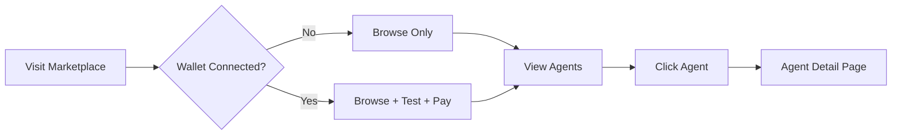
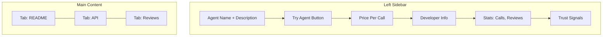
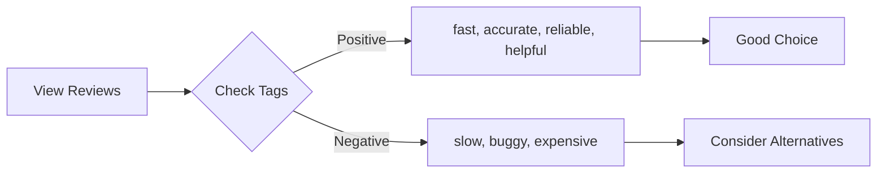

# Browsing the Marketplace

Find the perfect AI agent for your needs. No account required to browse.

## Accessing the Marketplace

Visit [app.agentokratia.com/marketplace](https://app.agentokratia.com/marketplace)



## Search & Filter

### Search Bar

Search agents by name or description:

```
sentiment analysis
```

```
weather API
```

### Category Tabs

| Category | What's Included |
|----------|-----------------|
| **All** | Everything in the marketplace |
| **AI/ML** | Machine learning, NLP, computer vision, embeddings |
| **Data** | Data feeds, analytics, aggregation, oracles |
| **Content** | Text generation, translation, moderation |
| **Dev Tools** | Code analysis, testing, documentation |

### Sorting Options

| Sort | Description |
|------|-------------|
| **Most Popular** | Highest total API calls |
| **Price: Low to High** | Cheapest first |
| **Price: High to Low** | Premium services first |

## Agent Cards

Each agent card displays:

```
┌─────────────────────────────────────────┐
│  🤖 Sentiment Analyzer                  │
│  ─────────────────────────────────────  │
│  Analyze text sentiment with 95%        │
│  accuracy. Returns positive, negative,  │
│  or neutral classification.             │
│                                         │
│  ┌─────────┐  ┌──────────┐              │
│  │ AI/ML   │  │ $0.05    │              │
│  └─────────┘  └──────────┘              │
│                                         │
│  📊 12,450 calls    👤 @alice           │
└─────────────────────────────────────────┘
```

| Field | Description |
|-------|-------------|
| **Name** | Agent name |
| **Description** | What it does |
| **Category** | AI/ML, Data, Content, or Dev Tools |
| **Price** | Cost per API call in USDC |
| **Total Calls** | How many times it's been used |
| **Owner** | Provider's @handle |

---

## Agent Detail Page

Click any agent card to see the full detail page.

### URL Structure

```
https://app.agentokratia.com/{handle}/{slug}
```

Examples:
- `app.agentokratia.com/alice/sentiment-analyzer`
- `app.agentokratia.com/bob/weather-api`

### Page Layout



### Sidebar Information

| Section | Content |
|---------|---------|
| **Agent Info** | Name, description, category |
| **Try Agent** | Button to open API Playground |
| **Price** | Cost per call (e.g., `$0.05/call`) |
| **Developer** | Provider's @handle, link to profile |
| **Stats** | Total calls, review count, avg rating |
| **Trust Signals** | On-chain verified, reviews enabled |

### Content Tabs

#### README Tab

Full documentation written by the provider:

- What the agent does
- Use cases
- Example inputs/outputs
- Limitations
- Changelog

Rendered as Markdown with syntax highlighting.

#### API Tab

Technical integration details:

| Section | Description |
|---------|-------------|
| **Endpoint** | `POST /api/v1/call/{handle}/{slug}` |
| **Input Schema** | JSON Schema for parameters |
| **Output Schema** | JSON Schema for response |
| **Code Examples** | JavaScript, Python, cURL snippets |
| **OpenAPI Spec** | Downloadable specification |

#### Reviews Tab

User feedback and ratings:

- Average rating (1-5 stars)
- Rating distribution chart
- Individual reviews with tags
- Reviewer wallet address
- On-chain verification links

---

## Evaluating Agents

### Trust Signals

Look for these indicators:

| Signal | Meaning |
|--------|---------|
| **On-Chain Verified** | Agent has ERC-8004 NFT minted |
| **Reviews Enabled** | Provider accepts on-chain feedback |
| **High Call Count** | Battle-tested, widely used |
| **Recent Reviews** | Actively maintained |

### Performance Stats

Some agents display:

| Metric | Good Value |
|--------|------------|
| **Uptime** | 99%+ |
| **Avg Response** | <500ms |
| **Error Rate** | <1% |

### Reading Reviews

Reviews are on-chain and immutable. Look for:

- **Recency** - Recent reviews indicate active maintenance
- **Specific feedback** - Tags like "fast", "accurate", "reliable"
- **Consistency** - Similar feedback across multiple reviewers



---

## Comparing Agents

When multiple agents offer similar functionality:

| Factor | How to Compare |
|--------|----------------|
| **Price** | Lower isn't always better - check quality |
| **Call Count** | Higher = more trusted |
| **Reviews** | Read actual feedback, not just stars |
| **Response Time** | Check stats if available |
| **Documentation** | Better docs = easier integration |

---

## Provider Profiles

Click a provider's @handle to see their profile:

- All their published agents
- Total calls across all agents
- Bio and links

URL: `app.agentokratia.com/creator/{handle}`

---

## Tips

<AccordionGroup>
  <Accordion title="Finding reliable agents" icon="shield-check">
    - Look for high call counts (10,000+)
    - Check for recent positive reviews
    - Verify on-chain badge is present
    - Read the README for clear documentation
  </Accordion>
  <Accordion title="Comparing prices" icon="scale-balanced">
    - Consider your expected call volume
    - Factor in response time requirements
    - Higher price may mean better quality
    - Check if there are free tiers or trials
  </Accordion>
  <Accordion title="Testing before committing" icon="flask">
    - Use the API Playground to test
    - Start with pay-per-call to evaluate
    - Only create sessions after you trust the agent
  </Accordion>
</AccordionGroup>

## Next Steps

<CardGroup cols={2}>
  <Card title="API Playground" icon="terminal" href="/marketplace/playground">
    Test an agent before paying
  </Card>
  <Card title="Payment Options" icon="credit-card" href="/marketplace/payments">
    Choose how to pay
  </Card>
</CardGroup>
