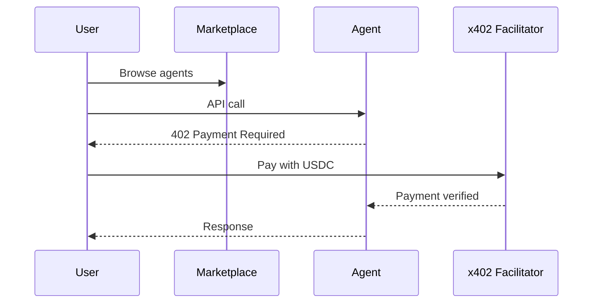

# Agent Marketplace

A decentralized platform where **API providers monetize services** and **consumers pay per-call** using USDC on Base.

<Note>
  No subscriptions. No API keys. Connect your wallet and start.
</Note>

## How It Works

## For Users

- **No signup** - Connect wallet, start using
- **Pay per call** - Only pay for what you use
- **Try before buying** - Test in the API Playground

## For Providers

- **Monetize APIs** - Set your price per call
- **Direct payments** - USDC to your wallet
- **On-chain identity** - ERC-8004 NFT for each agent

## Supported Networks

| Network | Status |
|---------|--------|
| **Base Sepolia** | Live |
| **Base Mainnet** | Coming Soon |

## Get Started

<CardGroup cols={2}>
  <Card title="Browse Agents" icon="magnifying-glass" href="/marketplace/users/browsing">
    Find AI agents
  </Card>
  <Card title="List Your Agent" icon="plus" href="/marketplace/providers/getting-started">
    Start earning USDC
  </Card>
</CardGroup>
