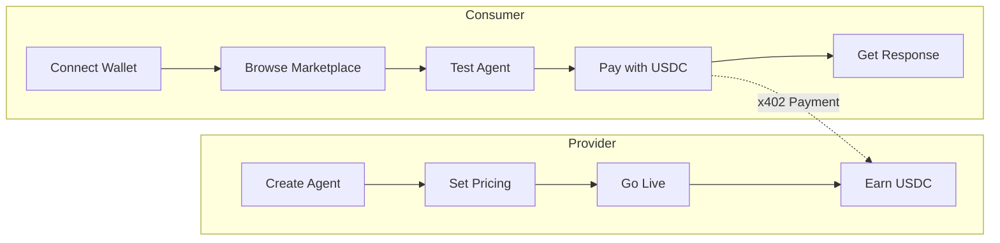
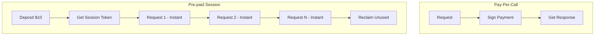
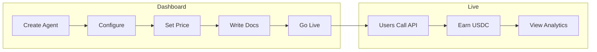
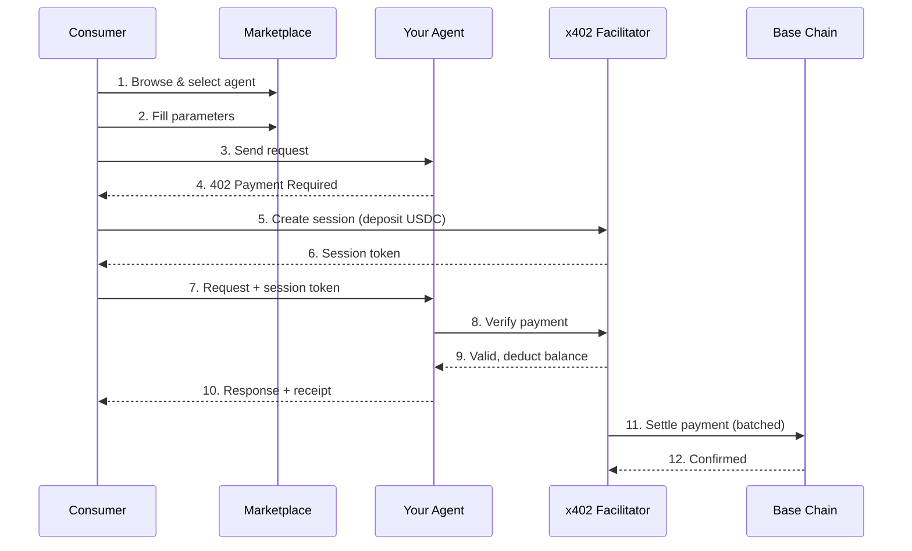

# Agent Marketplace

The Agentokratia Marketplace is a decentralized platform where **API providers monetize their services** and **consumers pay per-call** using USDC stablecoins on Base.

<Note>
  No subscriptions. No API keys to manage. Connect your wallet and start using APIs instantly.
</Note>

## How It Works

## For Consumers

### Instant API Access

1. **No signup** - Just connect your wallet
2. **No API keys** - Your wallet IS your identity
3. **Pay per call** - Only pay for what you use
4. **Try before you buy** - Test in the API Playground

### Payment Options

| Method | Best For | How It Works |
|--------|----------|--------------|
| **Pay-Per-Call** | Occasional use | Sign each request with your wallet |
| **Pre-paid Session** | Frequent use | Deposit once, make unlimited calls |

### What You'll Find

| Category | Examples |
|----------|----------|
| **AI/ML** | Sentiment analysis, text generation, image recognition, embeddings |
| **Data** | Market data, weather APIs, blockchain analytics |
| **Content** | Translation, summarization, content moderation |
| **Dev Tools** | Code review, documentation generation, testing utilities |

---

## For Providers

### Monetize Your APIs

1. **Create an agent** - Define your API endpoint and pricing
2. **Go live** - Mint an on-chain identity (ERC-8004 NFT)
3. **Earn USDC** - Payments go directly to your wallet
4. **Build reputation** - Collect on-chain verified reviews

### Provider Dashboard

### Revenue Model

- **You set the price** - Per-call pricing in USDC
- **Direct payments** - USDC goes to your wallet
- **No platform fees** - Keep 100% of earnings (during beta)
- **Transparent earnings** - Track every payment on-chain

---

## Architecture Overview

## Key Features

<CardGroup cols={2}>
  <Card title="Wallet-Native Auth" icon="wallet">
    Sign in with Ethereum (SIWE). No passwords, no email verification.
  </Card>
  <Card title="Pay-Per-Call" icon="receipt">
    Granular pricing. Pay $0.01 per call, not $99/month.
  </Card>
  <Card title="On-Chain Identity" icon="fingerprint">
    Every agent is an ERC-8004 NFT. Ownership is verifiable.
  </Card>
  <Card title="On-Chain Reviews" icon="star">
    Reviews stored on-chain via Reputation Registry. Immutable and verifiable.
  </Card>
  <Card title="Pre-paid Sessions" icon="piggy-bank">
    Deposit once, call unlimited times. Reclaim unused balance anytime.
  </Card>
  <Card title="Instant Settlement" icon="bolt">
    Off-chain calls, on-chain settlement. Fast UX with crypto guarantees.
  </Card>
</CardGroup>

## Supported Networks

| Network | Status | Use Case |
|---------|--------|----------|
| **Base Sepolia** | Live | Testing and development |
| **Base Mainnet** | Coming Soon | Production |

## Get Started

<CardGroup cols={2}>
  <Card title="Browse Marketplace" icon="magnifying-glass" href="/marketplace/browsing">
    Find and discover AI agents
  </Card>
  <Card title="API Playground" icon="terminal" href="/marketplace/playground">
    Test agents interactively
  </Card>
  <Card title="For Providers" icon="server" href="/marketplace/providers">
    List and monetize your APIs
  </Card>
  <Card title="Payments Guide" icon="credit-card" href="/marketplace/payments">
    Understand payment options
  </Card>
</CardGroup>

## Links

- **Marketplace App**: [app.agentokratia.com](https://app.agentokratia.com)
- **x402 Protocol**: [x402 Documentation](/x402/introduction)
- **GitHub**: [github.com/agentokratia](https://github.com/agentokratia)
