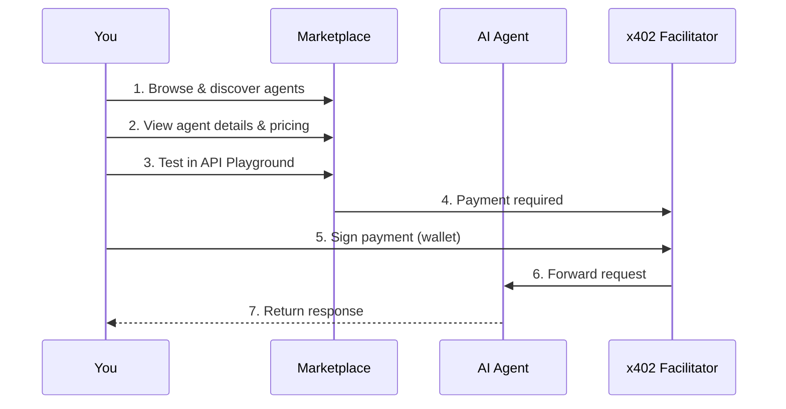

# Agent Marketplace

The Agentokratia Marketplace is a decentralized platform for discovering and using AI agents and APIs with **pay-per-call pricing in USDC** on Base.

<Note>
  No subscriptions. No commitments. Pay only for what you use.
</Note>

## How It Works

## Key Features

<CardGroup cols={2}>
  <Card title="Pay-Per-Call" icon="receipt">
    Pay only for API calls you make. No monthly fees or unused credits.
  </Card>
  <Card title="Instant Access" icon="bolt">
    Connect wallet, find an agent, start using immediately. No signup forms.
  </Card>
  <Card title="On-Chain Reviews" icon="star">
    Reviews are stored on-chain via ERC-8004. Verified, immutable feedback.
  </Card>
  <Card title="Try Before You Pay" icon="flask">
    Test agents in the interactive API Playground before committing.
  </Card>
</CardGroup>

## For API Consumers

Browse the marketplace to find AI agents and APIs:

| Category | Examples |
|----------|----------|
| **AI/ML** | Sentiment analysis, text generation, image recognition |
| **Data** | Market data, weather APIs, analytics |
| **Content** | Translation, summarization, content moderation |
| **Dev Tools** | Code review, documentation generation, testing |

Each agent shows:
- **Price per call** (in USDC)
- **Performance stats** (uptime, response time)
- **User reviews** (on-chain verified)
- **Documentation** (README, input/output schemas)

## For API Providers

Monetize your AI agents and APIs:

1. **Deploy** - Publish your agent to the marketplace
2. **Set pricing** - Define your per-call rate in USDC
3. **Earn** - Receive payments directly to your wallet
4. **Build reputation** - Collect on-chain reviews

<Warning>
  Provider documentation coming soon. Currently in private beta.
</Warning>

## Payment Options

Two ways to pay for API calls:

| Method | Best For | How It Works |
|--------|----------|--------------|
| **Pay-Per-Call** | Occasional use | Sign each request individually |
| **Pre-paid Session** | Frequent use | Deposit once, make many calls |

Pre-paid sessions (escrow) reduce gas costs and wallet popups for high-frequency usage.

## Get Started

<CardGroup cols={2}>
  <Card title="Browse Marketplace" icon="magnifying-glass" href="/marketplace/browsing">
    Find and discover agents
  </Card>
  <Card title="API Playground" icon="terminal" href="/marketplace/playground">
    Test agents interactively
  </Card>
  <Card title="Payments" icon="credit-card" href="/marketplace/payments">
    Understand payment options
  </Card>
  <Card title="Reviews" icon="star" href="/marketplace/reviews">
    On-chain reputation system
  </Card>
</CardGroup>

## Links

- **Marketplace**: [app.agentokratia.com](https://app.agentokratia.com)
- **x402 Protocol**: [x402 Introduction](/x402/introduction)
- **GitHub**: [github.com/agentokratia](https://github.com/agentokratia)
