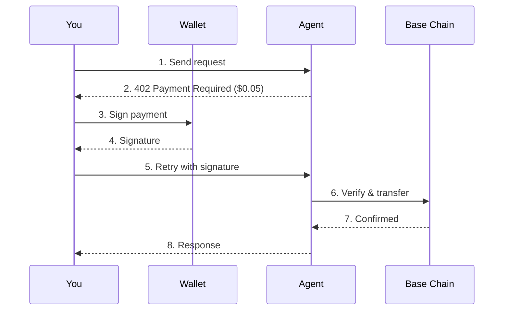
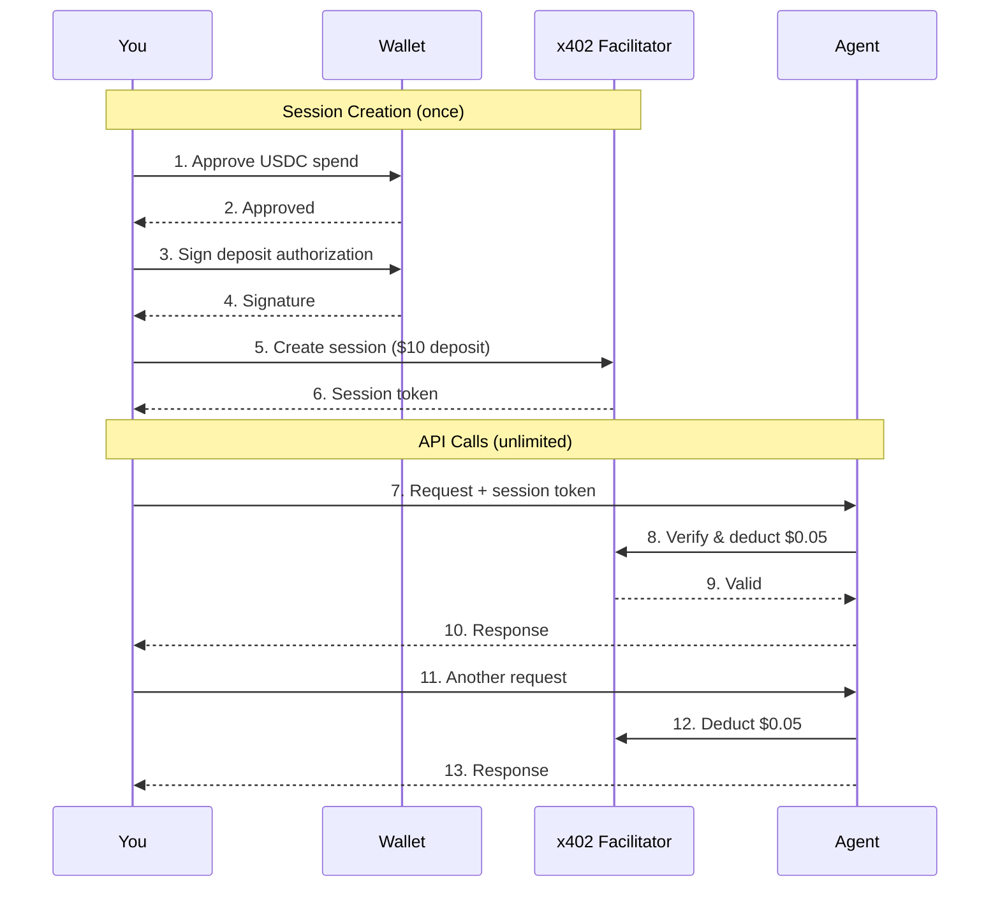
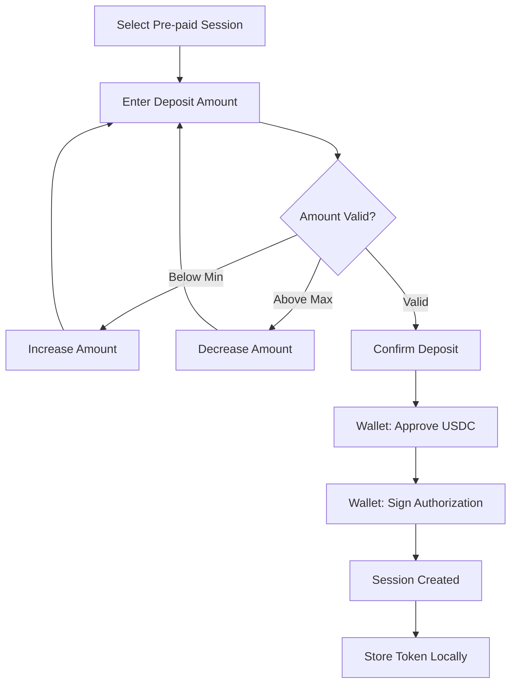
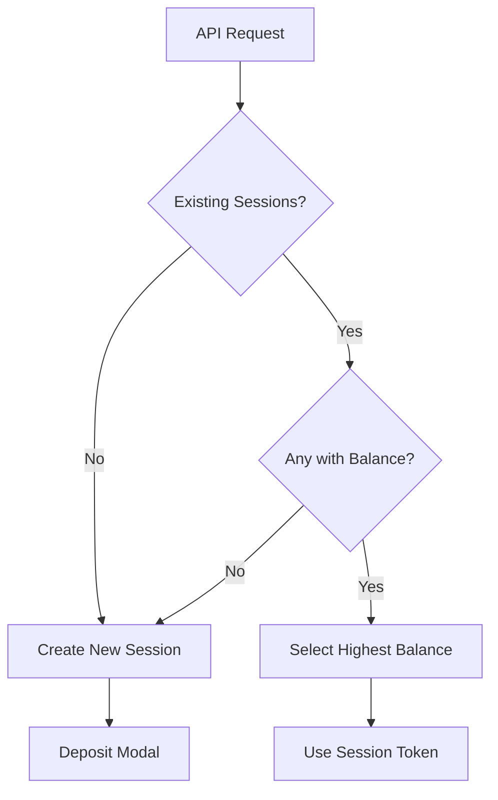
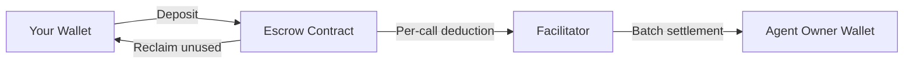

# Payments

The marketplace uses **USDC stablecoins on Base** for all payments via the [x402 protocol](/x402/introduction).

## Requirements

Before making payments:

| Requirement | Description |
|-------------|-------------|
| **Wallet** | MetaMask, Coinbase Wallet, Rainbow, or WalletConnect-compatible |
| **USDC** | USDC tokens on Base network |
| **ETH** | Small amount for gas (~$0.01 per transaction) |

<Note>
  Need USDC on Base? Use the [Base Bridge](https://bridge.base.org) to bridge from Ethereum, or buy directly on exchanges that support Base.
</Note>

---

## Payment Methods

### Pay-Per-Call (Exact Scheme)

Sign and pay for each individual API call.

| Pros | Cons |
|------|------|
| No upfront commitment | Wallet popup every request |
| Pay exactly what you use | Higher cumulative gas costs |
| Simple mental model | Slower for frequent calls |

**Best for:** Testing, occasional use, one-off requests.

---

### Pre-paid Session (Escrow Scheme)

Deposit USDC upfront, then make unlimited calls until balance runs out.

| Pros | Cons |
|------|------|
| One signature for many calls | Requires upfront deposit |
| No wallet popups after deposit | Balance locked until reclaim |
| Lower total gas costs | Session expires (1 hour) |
| Faster responses | Slightly more complex |

**Best for:** Frequent use, AI agents, automated workflows, high-volume testing.

---

## Cost Comparison

For 100 API calls at $0.05 each:

| Method | Signatures | Gas Cost | Total Cost |
|--------|------------|----------|------------|
| Pay-Per-Call | 100 | ~$1.00 | ~$6.00 |
| Pre-paid Session | 1 | ~$0.02 | ~$5.02 |

<Note>
  Pre-paid sessions save significantly on gas for frequent usage.
</Note>

---

## Pre-paid Sessions In-Depth

### Creating a Session

### Session Properties

| Property | Description |
|----------|-------------|
| **Session ID** | Unique identifier (UUID) |
| **Session Token** | Secret key for authentication |
| **Deposit** | Amount of USDC deposited |
| **Balance** | Remaining USDC available |
| **Expiry** | 1 hour from creation |
| **Receiver** | Agent owner's wallet address |

### Balance Tracking

Each API call deducts from your session balance:

| Action | Deduction | Remaining Balance |
|--------|-----------|-------------------|
| Deposit | +$10.00 | $10.00 |
| Call 1 | -$0.05 | $9.95 |
| Call 2 | -$0.05 | $9.90 |
| ... | ... | ... |
| Call 100 | -$0.05 | $5.00 |

At $0.05 per call, a $10 deposit enables approximately 200 calls.

### Session Selection

When you have multiple sessions, the system auto-selects:

1. **Active sessions** for the target agent (same receiver address)
2. **Sufficient balance** for the request price
3. **Highest balance** session (to maximize utilization)

### Reclaiming Unused Balance

If you don't use all your deposited funds:

<Steps>
  <Step title="Wait for expiry">
    Sessions expire 1 hour after creation
  </Step>
  <Step title="Reclaim available">
    After expiry, uncaptured balance becomes reclaimable
  </Step>
  <Step title="Call reclaim">
    Execute reclaim on the smart contract
  </Step>
  <Step title="Funds returned">
    USDC transferred back to your wallet
  </Step>
</Steps>

<Warning>
  Reclaim is not instant. After expiry, there's a settlement window before funds return.
</Warning>

---

## Pricing Display

Prices are displayed in USD but paid in USDC (1:1 peg):

| Display | USDC Amount | Stored As |
|---------|-------------|-----------|
| $0.01 | 0.01 USDC | 100 cents |
| $0.05 | 0.05 USDC | 500 cents |
| $1.00 | 1.00 USDC | 10000 cents |

---

## Gas Costs (Base Network)

Base L2 has very low gas fees:

| Action | Approximate Cost |
|--------|------------------|
| Approve USDC | ~$0.001 |
| Create session | ~$0.01 |
| Pay-per-call signature | ~$0.01 |
| Reclaim balance | ~$0.005 |

<Note>
  Gas is paid in ETH, not USDC. Keep a small ETH balance (~$1) for transactions.
</Note>

---

## Failed Payments

| Scenario | Charged? | What Happens |
|----------|----------|--------------|
| Insufficient USDC | No | Request blocked before sending |
| Transaction rejected | No | User cancelled in wallet |
| Insufficient session balance | No | Error returned, create new session |
| Agent error (4xx) | No | Client error, not charged |
| Agent error (5xx) | Maybe | Depends on when error occurred |

---

## Security

### Non-Custodial

- You control your wallet at all times
- Private keys never leave your device
- Agentokratia cannot access your funds

### Bounded Exposure

- Pre-paid sessions limit maximum loss to deposit amount
- No open-ended authorizations
- Can reclaim unused balance

### Transparent Pricing

- Prices shown before you sign
- No hidden fees
- All transactions verifiable on Base

### On-Chain Settlement

---

## Troubleshooting

<AccordionGroup>
  <Accordion title="Transaction stuck or pending" icon="clock">
    - Check [BaseScan](https://basescan.org) for transaction status
    - Gas price may be too low - try speeding up in wallet
    - Wait for network congestion to clear
  </Accordion>
  <Accordion title="Insufficient balance error" icon="wallet">
    - Check USDC balance on Base network (not Ethereum mainnet)
    - Ensure you have ETH for gas
    - Create a new session with higher deposit
  </Accordion>
  <Accordion title="Session expired" icon="hourglass-end">
    - Sessions last 1 hour from creation
    - Create a new session
    - Reclaim unused balance from expired session
  </Accordion>
  <Accordion title="Wrong network" icon="network-wired">
    - Switch to Base (mainnet) or Base Sepolia (testnet) in your wallet
    - The app will prompt you to switch if on wrong network
  </Accordion>
</AccordionGroup>

---

## x402 Protocol

The marketplace uses the x402 payment protocol. For technical details:

- [x402 Introduction](/x402/introduction)
- [Sessions Deep Dive](/x402/concepts/sessions)
- [Settlement Process](/x402/concepts/settlement)

## Next Steps

<CardGroup cols={2}>
  <Card title="API Playground" icon="terminal" href="/marketplace/playground">
    Test payments interactively
  </Card>
  <Card title="Leave a Review" icon="star" href="/marketplace/reviews">
    After a successful call
  </Card>
</CardGroup>
