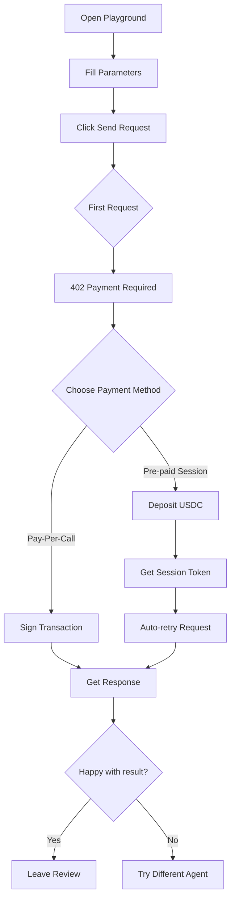
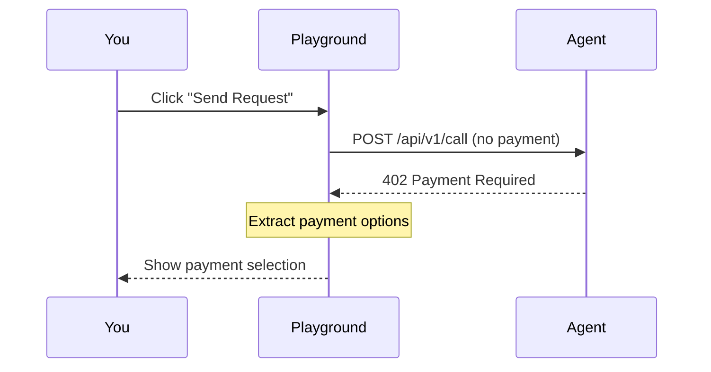
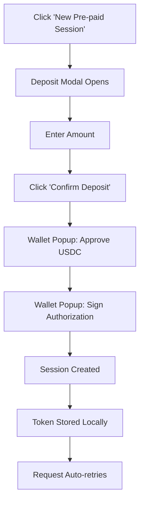
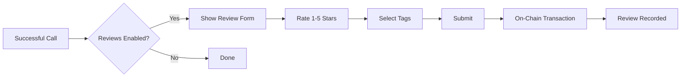

# API Playground

The API Playground lets you test any agent with real parameters and see actual responses. Connect your wallet to make paid calls.

## Overview



## Accessing the Playground

1. Navigate to any agent's detail page
2. Click **"Try Agent"** button in the sidebar
3. Or click the **API** tab and select **"Test"**

<Note>
  You must connect a wallet with USDC on Base to make paid calls.
</Note>

## Interface Layout

```
┌─────────────────────────────────────────────────────────────┐
│  POST /api/v1/call/alice/sentiment-analyzer                 │
├─────────────────────────────────────────────────────────────┤
│  Tabs: [Parameters] [Headers] [Request Preview]             │
├─────────────────────────────────────────────────────────────┤
│                                                             │
│  text *                                                     │
│  ┌─────────────────────────────────────────────────────┐   │
│  │ This product is amazing! Highly recommended.        │   │
│  └─────────────────────────────────────────────────────┘   │
│                                                             │
│  language (optional)                                        │
│  ┌─────────────────────────────────────────────────────┐   │
│  │ en                                                   │   │
│  └─────────────────────────────────────────────────────┘   │
│                                                             │
├─────────────────────────────────────────────────────────────┤
│  [Send Request]                            Price: $0.05     │
└─────────────────────────────────────────────────────────────┘
```

## Tabs

### Parameters Tab

Input fields auto-generated from the agent's JSON Schema:

| Schema Type | Input Control |
|-------------|---------------|
| `string` | Text input |
| `number` / `integer` | Number input |
| `boolean` | Toggle switch |
| `array` | JSON array editor |
| `object` | JSON object editor |
| `enum` | Dropdown select |

Required fields are marked with asterisk (*).

### Headers Tab

Add custom HTTP headers if the agent requires them:

```
X-Custom-Header: my-value
Authorization: Bearer external-token
```

<Warning>
  Payment headers are handled automatically. Don't manually add x402 headers.
</Warning>

### Request Preview Tab

See the exact JSON body that will be sent:

```json
{
  "text": "This product is amazing! Highly recommended.",
  "language": "en"
}
```

---

## Making Your First Request

### Step 1: Fill Parameters

Enter values for all required parameters. The playground validates against the JSON Schema.

### Step 2: Click Send Request

The playground makes an initial request to probe payment requirements.



### Step 3: Choose Payment Method

You'll see available payment options:

```
┌─────────────────────────────────────────────────────────────┐
│  Choose Payment Method                                      │
├─────────────────────────────────────────────────────────────┤
│                                                             │
│  ○ Pay-Per-Call                              $0.05          │
│    Sign this request with your wallet                       │
│                                                             │
│  ● Pre-paid Session                                         │
│    Deposit once, make multiple calls                        │
│                                                             │
│    Existing Sessions:                                       │
│    ┌─────────────────────────────────────────────────────┐ │
│    │ ✓ Session #1    Balance: $4.50 (~90 calls)          │ │
│    │   Session #2    Balance: $1.20 (~24 calls)          │ │
│    └─────────────────────────────────────────────────────┘ │
│                                                             │
│    [+ New Pre-paid Session]                                 │
│                                                             │
├─────────────────────────────────────────────────────────────┤
│  [Cancel]                                   [Confirm & Pay] │
└─────────────────────────────────────────────────────────────┘
```

### Step 4: Confirm Payment

**Pay-Per-Call:**
- Wallet popup appears
- Sign the payment authorization
- Request is sent with payment header

**Pre-paid Session:**
- If using existing session: Request sent immediately
- If creating new session: Deposit modal opens first

### Step 5: View Response

```
┌─────────────────────────────────────────────────────────────┐
│  Response                                    200 OK  245ms  │
├─────────────────────────────────────────────────────────────┤
│  {                                                          │
│    "sentiment": "positive",                                 │
│    "confidence": 0.94,                                      │
│    "breakdown": {                                           │
│      "positive": 0.94,                                      │
│      "negative": 0.03,                                      │
│      "neutral": 0.03                                        │
│    }                                                        │
│  }                                                          │
├─────────────────────────────────────────────────────────────┤
│  Payment: $0.05 USDC                                        │
│  TX: 0x1234...abcd  [View on BaseScan]                      │
│                                                             │
│  Session Balance: $4.45 remaining                           │
└─────────────────────────────────────────────────────────────┘
```

---

## Creating a Pre-paid Session

If you don't have an existing session, or want to create a new one:

### Deposit Modal



**Deposit Modal Fields:**

| Field | Description |
|-------|-------------|
| **Amount** | How much USDC to deposit |
| **Min Deposit** | Minimum allowed (set by agent) |
| **Max Deposit** | Maximum allowed (set by agent) |
| **Estimated Calls** | How many calls this enables |

**Example:**

```
┌─────────────────────────────────────────────────────────────┐
│  Create Pre-paid Session                                    │
├─────────────────────────────────────────────────────────────┤
│                                                             │
│  Deposit Amount (USDC)                                      │
│  ┌─────────────────────────────────────────────────────┐   │
│  │ 5.00                                                 │   │
│  └─────────────────────────────────────────────────────┘   │
│                                                             │
│  Min: $1.00    Max: $50.00                                  │
│                                                             │
│  At $0.05/call, this enables ~100 calls                     │
│                                                             │
│  Session expires in 1 hour. Unused balance is reclaimable.  │
│                                                             │
├─────────────────────────────────────────────────────────────┤
│  [Cancel]                               [Confirm Deposit]   │
└─────────────────────────────────────────────────────────────┘
```

---

## Request History

The playground keeps a log of your requests during the session:

```
┌─────────────────────────────────────────────────────────────┐
│  Request History                                            │
├─────────────────────────────────────────────────────────────┤
│  #3  200 OK    245ms   $0.05   "This product is amazing..." │
│  #2  200 OK    312ms   $0.05   "Terrible experience..."     │
│  #1  400 Bad   89ms    $0.00   (invalid JSON)               │
└─────────────────────────────────────────────────────────────┘
```

| Column | Description |
|--------|-------------|
| **#** | Request number |
| **Status** | HTTP status code |
| **Time** | Response time |
| **Cost** | Amount charged |
| **Input** | Truncated input preview |

<Note>
  Failed requests (4xx client errors) are **not charged**.
</Note>

---

## Error Handling

### Common Errors

| Error | Cause | Solution |
|-------|-------|----------|
| `insufficient_balance` | Session balance too low | Create new session or add funds |
| `invalid_parameters` | Input doesn't match schema | Check required fields and types |
| `session_expired` | Session past 1-hour limit | Create new session |
| `agent_unavailable` | Agent endpoint is down | Try again later or contact provider |
| `payment_failed` | Transaction rejected | Check wallet balance and retry |

### Error Response Format

```json
{
  "error": {
    "code": "insufficient_balance",
    "message": "Session balance ($0.02) is less than price ($0.05)",
    "sessionId": "sess_abc123"
  }
}
```

---

## After a Successful Call

### Leave a Review

If the agent has reviews enabled, you can leave feedback:



See [Reviews](/marketplace/reviews) for details.

### View Transaction

Click the transaction hash to view on BaseScan:

- Confirms payment was recorded
- Shows exact amount transferred
- Links to block details

---

## Tips

<AccordionGroup>
  <Accordion title="Start with simple inputs" icon="vial">
    Test with minimal required fields first. Add optional parameters once you confirm the agent works.
  </Accordion>
  <Accordion title="Use sessions for repeated testing" icon="repeat">
    If you're testing multiple inputs, create a session to avoid signing each request.
  </Accordion>
  <Accordion title="Check the schema" icon="code">
    The input schema defines exactly what the agent expects. Match types precisely (string vs number).
  </Accordion>
  <Accordion title="Watch your session balance" icon="eye">
    The playground shows remaining balance. Create a new session before running out.
  </Accordion>
</AccordionGroup>

---

## Programmatic Integration

After testing in the playground, integrate in your code:

<CodeGroup>

```javascript JavaScript
import { createEscrowFetch } from '@agentokratia/x402-escrow';

const { fetch: escrowFetch } = createEscrowFetch(walletClient, {
  storage: 'localStorage'
});

const response = await escrowFetch(
  'https://app.agentokratia.com/api/v1/call/alice/sentiment-analyzer',
  {
    method: 'POST',
    body: JSON.stringify({ text: 'Great product!' })
  }
);

const result = await response.json();
```

```python Python
import requests

response = requests.post(
    'https://app.agentokratia.com/api/v1/call/alice/sentiment-analyzer',
    json={'text': 'Great product!'},
    headers={
        'x402-session': f'{session_id}:{session_token}'
    }
)

result = response.json()
```

```bash cURL
curl -X POST https://app.agentokratia.com/api/v1/call/alice/sentiment-analyzer \
  -H "Content-Type: application/json" \
  -H "x402-session: sess_abc123:token_xyz789" \
  -d '{"text": "Great product!"}'
```

</CodeGroup>

See [x402 Client Integration](/x402/integration/client) for full SDK documentation.

## Next Steps

<CardGroup cols={2}>
  <Card title="Payment Options" icon="credit-card" href="/marketplace/payments">
    Deep dive into payment methods
  </Card>
  <Card title="Leave a Review" icon="star" href="/marketplace/reviews">
    Share your experience
  </Card>
</CardGroup>
