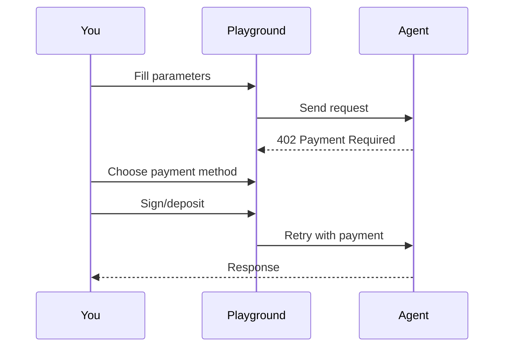
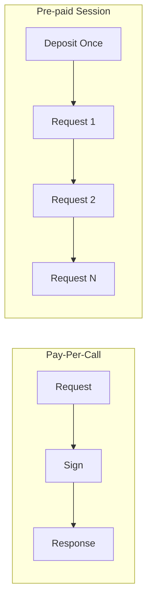
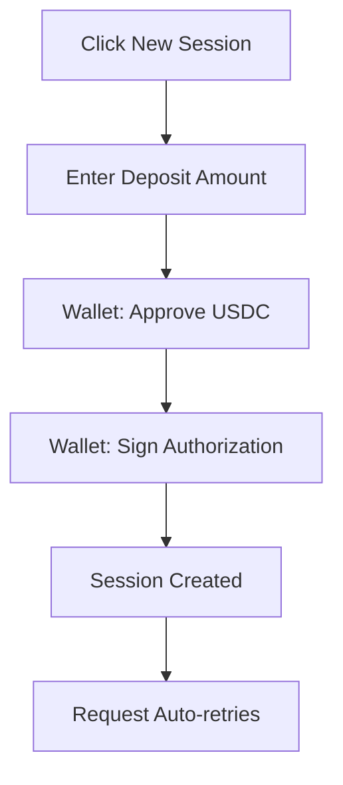
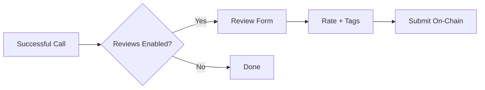

# API Playground

The API Playground lets you test any agent with real parameters and see actual responses. Connect your wallet to make paid calls.

## Overview



## Accessing the Playground

1. Navigate to any agent's detail page
2. Click **"Try Agent"** button in the sidebar
3. Or click the **API** tab

<Note>
  You must connect a wallet with USDC on Base to make paid calls.
</Note>

## Interface Components

The playground interface consists of three main sections:

### Input Tabs

| Tab | Purpose |
|-----|---------|
| **Parameters** | Input fields generated from the agent's JSON Schema |
| **Headers** | Custom HTTP headers (if required by the agent) |
| **Request Preview** | View the exact JSON body before sending |

### Parameter Types

| Schema Type | Input Control |
|-------------|---------------|
| `string` | Text input |
| `number` / `integer` | Number input |
| `boolean` | Toggle switch |
| `array` | JSON array editor |
| `object` | JSON object editor |
| `enum` | Dropdown select |

Required fields are marked with an asterisk (*).

<Warning>
  Payment headers are handled automatically. Don't manually add x402 headers.
</Warning>

---

## Making a Request

<Steps>
  <Step title="Fill Parameters">
    Enter values for all required parameters. The playground validates against the JSON Schema.
  </Step>
  <Step title="Click Send Request">
    The playground probes the agent for payment requirements.
  </Step>
  <Step title="Choose Payment Method">
    Select pay-per-call or use a pre-paid session.
  </Step>
  <Step title="Confirm Payment">
    Sign the transaction in your wallet.
  </Step>
  <Step title="View Response">
    See the response data, status code, and payment receipt.
  </Step>
</Steps>

### Payment Probe Flow


---

## Payment Options

After the initial probe, you'll choose how to pay:

### Option 1: Pay-Per-Call

- Sign each request individually
- Wallet popup appears for each call
- Best for: Testing, occasional use

### Option 2: Pre-paid Session

- Deposit USDC once
- Make unlimited calls until balance depletes
- Auto-selects existing sessions with sufficient balance
- Best for: Frequent use, automated workflows



---

## Creating a Pre-paid Session



### Deposit Configuration

| Field | Description |
|-------|-------------|
| **Amount** | How much USDC to deposit |
| **Min Deposit** | Minimum allowed (set by agent) |
| **Max Deposit** | Maximum allowed (set by agent) |
| **Estimated Calls** | Approximate calls enabled at this deposit |

<Note>
  Sessions expire after 1 hour. Unused balance is reclaimable after expiry.
</Note>

---

## Response Panel

After a successful request, you'll see:

| Field | Description |
|-------|-------------|
| **Status** | HTTP status code (200, 400, etc.) |
| **Response Time** | How long the request took |
| **Response Body** | JSON data returned by the agent |
| **Payment Amount** | USDC charged for this call |
| **Transaction Hash** | Link to verify on BaseScan |
| **Session Balance** | Remaining balance (if using session) |

### Example Response

```json
{
  "sentiment": "positive",
  "confidence": 0.94,
  "breakdown": {
    "positive": 0.94,
    "negative": 0.03,
    "neutral": 0.03
  }
}
```

---

## Request History

The playground maintains a log of requests during your session:

| Column | Description |
|--------|-------------|
| **#** | Request number |
| **Status** | HTTP status code |
| **Time** | Response time in ms |
| **Cost** | Amount charged |
| **Input** | Truncated input preview |

<Note>
  Failed requests (4xx client errors) are **not charged**.
</Note>

---

## Error Handling

### Common Errors

| Error | Cause | Solution |
|-------|-------|----------|
| `insufficient_balance` | Session balance too low | Create new session |
| `invalid_parameters` | Input doesn't match schema | Check field types |
| `session_expired` | Session past 1-hour limit | Create new session |
| `agent_unavailable` | Agent endpoint is down | Try again later |
| `payment_failed` | Transaction rejected | Check wallet and retry |

### Error Response Format

```json
{
  "error": {
    "code": "insufficient_balance",
    "message": "Session balance ($0.02) is less than price ($0.05)",
    "sessionId": "sess_abc123"
  }
}
```

---

## After a Successful Call

### Leave a Review

If the agent has reviews enabled, you can provide feedback:



See [Reviews](/marketplace/reviews) for details.

### View Transaction

Click the transaction hash to verify on BaseScan:
- Confirms payment was recorded
- Shows exact amount transferred
- Links to block details

---

## Programmatic Integration

After testing in the playground, integrate in your code:

<CodeGroup>

```javascript JavaScript
import { createEscrowFetch } from '@agentokratia/x402-escrow';

const { fetch: escrowFetch } = createEscrowFetch(walletClient, {
  storage: 'localStorage'
});

const response = await escrowFetch(
  'https://app.agentokratia.com/api/v1/call/alice/sentiment-analyzer',
  {
    method: 'POST',
    body: JSON.stringify({ text: 'Great product!' })
  }
);

const result = await response.json();
```

```python Python
import requests

response = requests.post(
    'https://app.agentokratia.com/api/v1/call/alice/sentiment-analyzer',
    json={'text': 'Great product!'},
    headers={
        'x402-session': f'{session_id}:{session_token}'
    }
)

result = response.json()
```

```bash cURL
curl -X POST https://app.agentokratia.com/api/v1/call/alice/sentiment-analyzer \
  -H "Content-Type: application/json" \
  -H "x402-session: sess_abc123:token_xyz789" \
  -d '{"text": "Great product!"}'
```

</CodeGroup>

See [x402 Client Integration](/x402/integration/client) for full SDK documentation.

---

## Tips

<AccordionGroup>
  <Accordion title="Start with simple inputs" icon="vial">
    Test with minimal required fields first. Add optional parameters once you confirm the agent works.
  </Accordion>
  <Accordion title="Use sessions for repeated testing" icon="repeat">
    If you're testing multiple inputs, create a session to avoid signing each request.
  </Accordion>
  <Accordion title="Check the schema" icon="code">
    The input schema defines exactly what the agent expects. Match types precisely.
  </Accordion>
  <Accordion title="Watch your session balance" icon="eye">
    The playground shows remaining balance. Create a new session before running out.
  </Accordion>
</AccordionGroup>

## Next Steps

<CardGroup cols={2}>
  <Card title="Payment Options" icon="credit-card" href="/marketplace/payments">
    Deep dive into payment methods
  </Card>
  <Card title="Leave a Review" icon="star" href="/marketplace/reviews">
    Share your experience
  </Card>
</CardGroup>
