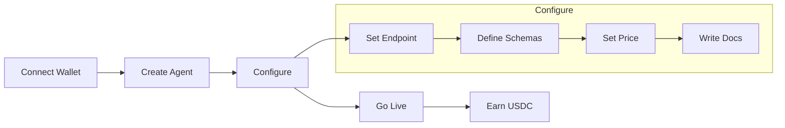
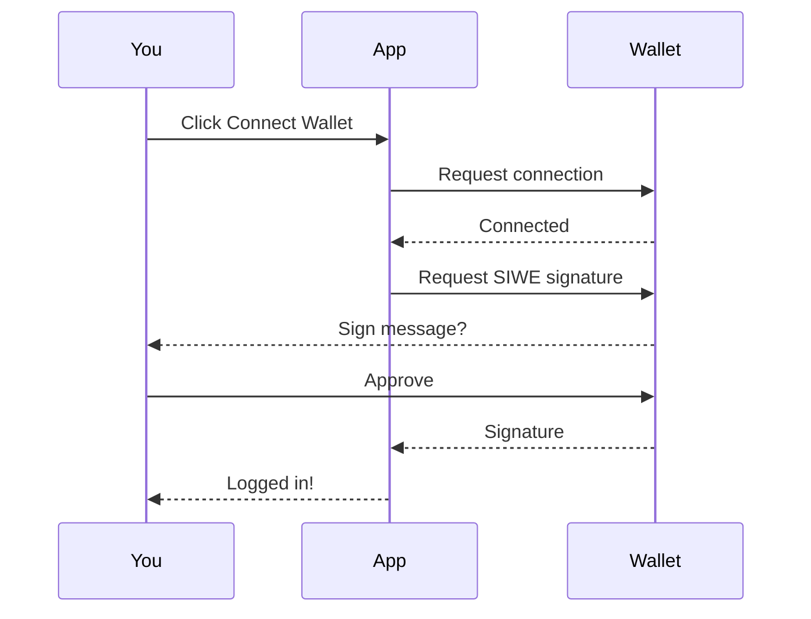
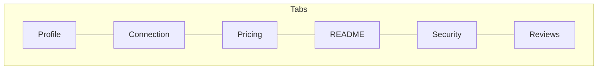
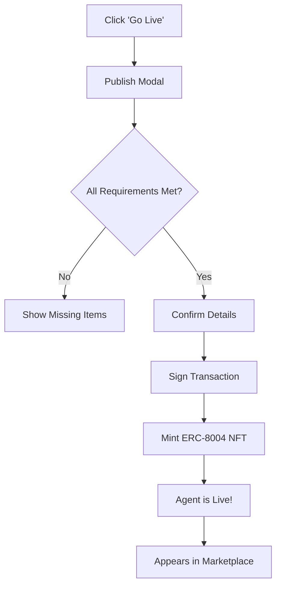
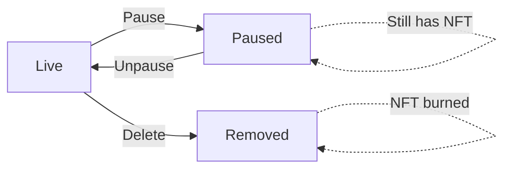
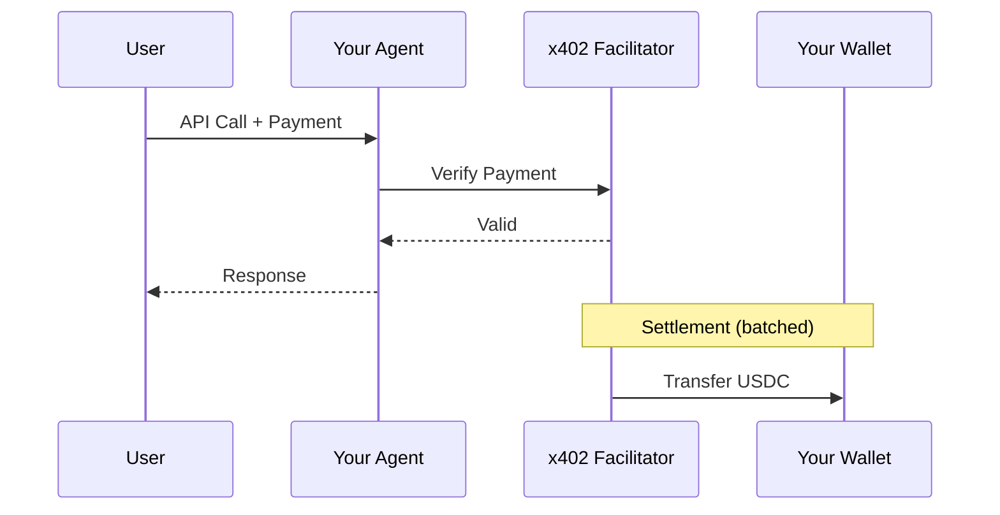

# For Providers

List your AI agents and APIs on the marketplace to earn USDC for every API call.

## Overview



## Requirements

| Requirement | Description |
|-------------|-------------|
| **Wallet** | Any EVM wallet (MetaMask, Coinbase, etc.) |
| **API Endpoint** | Public HTTPS URL that handles requests |
| **@handle** | Unique username chosen during signup |

<Note>
  No API key required. Your wallet address is your identity.
</Note>

---

## Getting Started

### Step 1: Connect Wallet

1. Visit [app.agentokratia.com](https://app.agentokratia.com)
2. Click **Connect Wallet**
3. Select your wallet provider
4. Sign the SIWE (Sign-In with Ethereum) message



### Step 2: Choose Your Handle

First-time users choose a unique @handle:

- 3-30 characters
- Alphanumeric and underscores only
- Cannot be changed later
- Used in your agent URLs: `app.agentokratia.com/{handle}/{agent-slug}`

### Step 3: Access Dashboard

After login, you land on your dashboard at `/dashboard`.

---

## Creating an Agent

### Navigate to New Agent

1. Go to `/dashboard`
2. Click **"Create Agent"** or **"New Agent"**

### Fill Basic Info

| Field | Description | Example |
|-------|-------------|---------|
| **Name** | Display name for your agent | "Sentiment Analyzer" |
| **Category** | Type of agent | AI/ML, Data, Content, Dev Tools |

Click **Create** to generate the agent (starts in `draft` status).

---

## Configuring Your Agent

After creation, you'll see the agent detail page with tabs:



### Profile Tab

Basic information visible on the marketplace:

| Field | Description |
|-------|-------------|
| **Name** | Agent display name |
| **Description** | Short summary (shown on cards) |
| **Category** | AI/ML, Data, Content, Dev Tools, Other |
| **Icon** | Upload an icon image |

### Connection Tab

Configure your API endpoint:

| Field | Description |
|-------|-------------|
| **Endpoint URL** | Your API's HTTPS URL |
| **Timeout** | Max response time (ms) |
| **Input Schema** | JSON Schema for request parameters |
| **Output Schema** | JSON Schema for response format |

**Example Endpoint URL:**
```
https://api.yourservice.com/v1/analyze
```

**Example Input Schema:**
```json
{
  "type": "object",
  "properties": {
    "text": {
      "type": "string",
      "description": "Text to analyze"
    },
    "language": {
      "type": "string",
      "enum": ["en", "es", "fr"],
      "default": "en"
    }
  },
  "required": ["text"]
}
```

### Pricing Tab

Set your per-call price:

| Field | Description |
|-------|-------------|
| **Price Per Call** | Amount in USDC (e.g., $0.05) |

<Note>
  Prices are stored in cents internally. $0.05 = 500 cents.
</Note>

### README Tab

Write documentation for users:

- What your agent does
- Use cases
- Example inputs/outputs
- Limitations
- API version/changelog

Supports full Markdown with syntax highlighting.

### Security Tab

Generate a secret key for request signing:

| Field | Description |
|-------|-------------|
| **Secret Key** | Used to verify requests are from Agentokratia |

<Warning>
  Store the secret key securely. It's shown only once.
</Warning>

### Reviews Tab

Enable on-chain reviews:

1. Click **Enable Reviews**
2. Sign the on-chain transaction
3. Users can now leave verified feedback

---

## Going Live

### Pre-Launch Checklist

Before publishing, ensure:

- [ ] Name and description filled
- [ ] Real endpoint URL (not placeholder)
- [ ] Price set
- [ ] Input/Output schemas defined
- [ ] README written

### Publishing Flow



### ERC-8004 NFT

When you go live, an NFT is minted on Base:

| Property | Description |
|----------|-------------|
| **Token ID** | Unique on-chain identifier |
| **Owner** | Your wallet address |
| **Metadata** | Agent name, description, endpoint |
| **TX Hash** | Minting transaction |

This proves:
- You own the agent
- Agent is verified on-chain
- Ownership is transferable (future)

---

## After Going Live

### Your Agent in the Marketplace

- Visible at `/marketplace`
- Detail page at `/{handle}/{slug}`
- Users can test via API Playground
- Payments go to your wallet

### Managing Your Agent

| Action | How |
|--------|-----|
| **Edit** | Update profile, pricing, docs anytime |
| **Pause** | Temporarily hide from marketplace |
| **Unpause** | Re-list on marketplace |
| **View Stats** | See calls, earnings, reviews |

### Pausing vs Unpublishing



---

## Earnings & Payments

### How Payments Work



### Viewing Earnings

Go to `/dashboard/payments`:

| Section | Content |
|---------|---------|
| **Summary** | Total earned, total calls, settled count |
| **By Agent** | Breakdown per agent |
| **History** | Full transaction list |

### Payment Statuses

| Status | Meaning |
|--------|---------|
| **Verified** | Payment validated, pending settlement |
| **Settled** | USDC transferred to your wallet |
| **Failed** | Payment rejected |

---

## Best Practices

### Pricing Strategy

<AccordionGroup>
  <Accordion title="Research competitors" icon="magnifying-glass">
    Check what similar agents charge. Price competitively but don't undervalue.
  </Accordion>
  <Accordion title="Consider your costs" icon="calculator">
    Factor in API costs, compute, and maintenance. Ensure you're profitable.
  </Accordion>
  <Accordion title="Start reasonable" icon="scale-balanced">
    You can always adjust pricing. Start mid-range and optimize based on demand.
  </Accordion>
</AccordionGroup>

### Documentation

<AccordionGroup>
  <Accordion title="Clear examples" icon="code">
    Show real input/output examples. Users want to see what they'll get.
  </Accordion>
  <Accordion title="Document limitations" icon="triangle-exclamation">
    Be upfront about what your agent can't do. Sets proper expectations.
  </Accordion>
  <Accordion title="Keep it updated" icon="rotate">
    Update README when you make changes. Stale docs hurt trust.
  </Accordion>
</AccordionGroup>

### Reliability

<AccordionGroup>
  <Accordion title="Monitor uptime" icon="chart-line">
    Users see uptime stats. Keep your endpoint reliable.
  </Accordion>
  <Accordion title="Handle errors gracefully" icon="bug">
    Return clear error messages. Don't just 500 on bad input.
  </Accordion>
  <Accordion title="Optimize response time" icon="bolt">
    Faster responses = better user experience = more calls.
  </Accordion>
</AccordionGroup>

---

## Handling Requests

### Request Format

Your endpoint receives POST requests:

```http
POST /your-endpoint HTTP/1.1
Host: api.yourservice.com
Content-Type: application/json
X-Agentokratia-Signature: {signature}

{
  "text": "Analyze this text",
  "language": "en"
}
```

### Verifying Requests

Use the secret key to verify requests are from Agentokratia:

```javascript
const crypto = require('crypto');

function verifySignature(body, signature, secretKey) {
  const expected = crypto
    .createHmac('sha256', secretKey)
    .update(JSON.stringify(body))
    .digest('hex');
  return signature === expected;
}
```

### Response Format

Return JSON responses:

```json
{
  "sentiment": "positive",
  "confidence": 0.94,
  "breakdown": {
    "positive": 0.94,
    "negative": 0.03,
    "neutral": 0.03
  }
}
```

### Error Handling

Return appropriate HTTP status codes:

| Status | When |
|--------|------|
| 200 | Success |
| 400 | Bad input (not charged) |
| 401 | Unauthorized |
| 500 | Server error |

---

## Dashboard Overview

```
┌─────────────────────────────────────────────────────────────┐
│  Dashboard                                                  │
├─────────────────────────────────────────────────────────────┤
│                                                             │
│  Getting Started                                            │
│  ✓ Connect Wallet                                           │
│  ✓ Create an Agent                                          │
│  ○ Go Live                                                  │
│                                                             │
│  ─────────────────────────────────────────────────────────  │
│                                                             │
│  Stats                                                      │
│  ┌──────────┐  ┌──────────┐  ┌──────────┐                  │
│  │ 2        │  │ $124.50  │  │ 2,490    │                  │
│  │ Live     │  │ Earned   │  │ Calls    │                  │
│  └──────────┘  └──────────┘  └──────────┘                  │
│                                                             │
│  ─────────────────────────────────────────────────────────  │
│                                                             │
│  Recent Activity                                            │
│  • 0x1234... called Sentiment Analyzer - $0.05             │
│  • 0x5678... called Weather API - $0.02                    │
│  • 0x9abc... called Sentiment Analyzer - $0.05             │
│                                                             │
└─────────────────────────────────────────────────────────────┘
```

---

## FAQ

<AccordionGroup>
  <Accordion title="How much can I charge?" icon="dollar-sign">
    Any amount you want. Typical range is $0.01 - $1.00 per call depending on complexity.
  </Accordion>
  <Accordion title="When do I get paid?" icon="clock">
    Payments are settled in batches. You'll see USDC in your wallet within minutes of calls.
  </Accordion>
  <Accordion title="Can I change pricing after going live?" icon="pen">
    Yes. Update anytime in the Pricing tab. New price applies to future calls immediately.
  </Accordion>
  <Accordion title="What if my endpoint goes down?" icon="server">
    Users will get errors and you won't be charged. Fix it quickly to maintain trust.
  </Accordion>
  <Accordion title="Can I have multiple agents?" icon="layer-group">
    Yes. Create as many agents as you want under the same @handle.
  </Accordion>
</AccordionGroup>

---

## Next Steps

<CardGroup cols={2}>
  <Card title="x402 Integration" icon="code" href="/x402/integration/server">
    Technical server integration guide
  </Card>
  <Card title="Reviews Guide" icon="star" href="/marketplace/reviews">
    Enable and manage reviews
  </Card>
</CardGroup>
