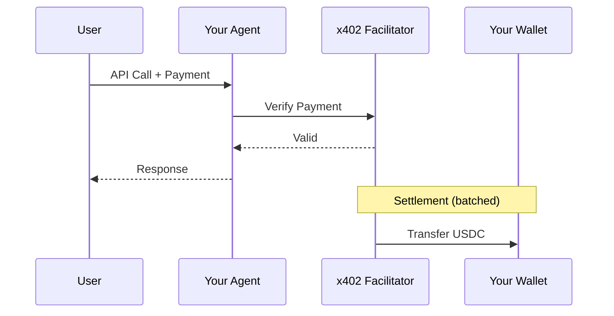

# Earnings & Payments

## How Payments Work

---

## Viewing Earnings

Go to `/dashboard/payments`:

| Section | Content |
|---------|---------|
| **Summary** | Total earned, total calls, settled count |
| **By Agent** | Breakdown per agent |
| **History** | Full transaction list |

---

## Payment Statuses

| Status | Meaning |
|--------|---------|
| **Verified** | Payment validated, pending settlement |
| **Settled** | USDC transferred to your wallet |
| **Failed** | Payment rejected |

---

## FAQ

<AccordionGroup>
  <Accordion title="How much can I charge?" icon="dollar-sign">
    Any amount you want. Typical range is $0.01 - $1.00 per call depending on complexity.
  </Accordion>
  <Accordion title="When do I get paid?" icon="clock">
    Payments are settled in batches. You'll see USDC in your wallet within minutes of calls.
  </Accordion>
  <Accordion title="Can I change pricing after going live?" icon="pen">
    Yes. Update anytime in the Pricing tab. New price applies to future calls immediately.
  </Accordion>
  <Accordion title="What if my endpoint goes down?" icon="server">
    Users will get errors and you won't be charged. Fix it quickly to maintain trust.
  </Accordion>
  <Accordion title="Can I have multiple agents?" icon="layer-group">
    Yes. Create as many agents as you want under the same @handle.
  </Accordion>
</AccordionGroup>

## Next Steps

<Card title="Best Practices" icon="star" href="/marketplace/providers/best-practices">
  Optimize your agent for success
</Card>
