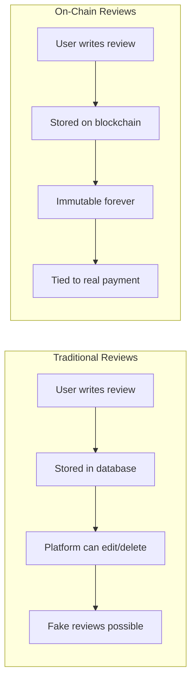
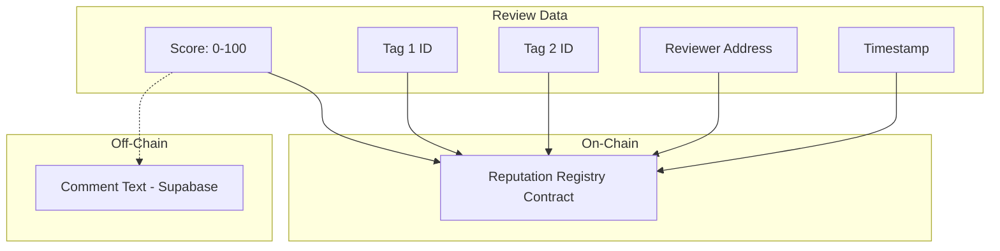

# Reviews

The marketplace uses an **on-chain reputation system** powered by ERC-8004. Reviews are immutable, verifiable, and tied to actual payments.

## Why On-Chain Reviews?



| Traditional Reviews | On-Chain Reviews |
|--------------------|------------------|
| Platform can delete | Immutable |
| Editable by admin | Cannot be changed |
| No payment verification | Tied to transaction |
| Trust the platform | Trust the blockchain |

---

## How Reviews Work

### Prerequisites

To leave a review, you must:

1. **Make a successful paid call** to the agent
2. **Receive feedback tokens** in the response headers
3. **Agent has reviews enabled** (provider opted in)
4. **Submit within 1 hour** of the call (token expiry)


### Review Flow

<Steps>
  <Step title="Complete a paid call">
    Make a successful API request through the playground or SDK
  </Step>
  <Step title="See review option">
    After response, "Leave a Review" appears if reviews are enabled
  </Step>
  <Step title="Rate the agent">
    Select 1-5 stars
  </Step>
  <Step title="Add feedback tags">
    Select up to 2 tags describing your experience
  </Step>
  <Step title="Submit">
    Sign the transaction to record on-chain
  </Step>
</Steps>

---

## Rating System

### Star Ratings

| Rating | Meaning |
|--------|---------|
| ⭐⭐⭐⭐⭐ | Excellent - exceeded expectations |
| ⭐⭐⭐⭐☆ | Good - met expectations |
| ⭐⭐⭐☆☆ | Average - acceptable |
| ⭐⭐☆☆☆ | Below average - some issues |
| ⭐☆☆☆☆ | Poor - significant problems |

### Feedback Tags

Quick descriptors for your experience:

**Positive Tags:**
| Tag | When to Use |
|-----|-------------|
| **Fast** | Response time was excellent |
| **Accurate** | Results were correct and reliable |
| **Reliable** | Consistent quality over multiple calls |
| **Helpful** | Solved your problem effectively |

**Negative Tags:**
| Tag | When to Use |
|-----|-------------|
| **Slow** | Response time was too long |
| **Buggy** | Errors or unexpected behavior |
| **Expensive** | Not worth the price |

<Note>
  You can select up to 2 tags per review.
</Note>

---

## Review Form

```
┌─────────────────────────────────────────────────────────────┐
│  Leave a Review                                             │
├─────────────────────────────────────────────────────────────┤
│                                                             │
│  How was your experience?                                   │
│                                                             │
│  ☆ ☆ ☆ ☆ ☆                                                 │
│                                                             │
│  Select up to 2 tags:                                       │
│                                                             │
│  [Fast] [Accurate] [Reliable] [Helpful]                     │
│  [Slow] [Buggy] [Expensive]                                 │
│                                                             │
│  Comment (optional):                                        │
│  ┌─────────────────────────────────────────────────────┐   │
│  │ Great sentiment analysis! Very accurate results.    │   │
│  └─────────────────────────────────────────────────────┘   │
│                                                             │
├─────────────────────────────────────────────────────────────┤
│  [Cancel]                                [Submit Review]    │
└─────────────────────────────────────────────────────────────┘
```

---

## Viewing Reviews

On any agent's detail page, click the **Reviews** tab.

### Review Stats

```
┌─────────────────────────────────────────────────────────────┐
│  Reviews                                                    │
├─────────────────────────────────────────────────────────────┤
│                                                             │
│  Average Rating: 4.2 ⭐  (156 reviews)                      │
│                                                             │
│  ⭐⭐⭐⭐⭐  ████████████████████  65%                      │
│  ⭐⭐⭐⭐☆  ██████████            25%                      │
│  ⭐⭐⭐☆☆  ████                   8%                      │
│  ⭐⭐☆☆☆  █                       1%                      │
│  ⭐☆☆☆☆  ░                       1%                      │
│                                                             │
└─────────────────────────────────────────────────────────────┘
```

### Individual Reviews

```
┌─────────────────────────────────────────────────────────────┐
│  0x1234...abcd                              2 hours ago     │
│  ⭐⭐⭐⭐⭐  [Fast] [Accurate]                               │
│                                                             │
│  "Excellent sentiment analysis. Very accurate results       │
│   even with complex sentences."                             │
│                                                             │
│  TX: 0x5678...  [View on BaseScan]                          │
└─────────────────────────────────────────────────────────────┘
```

| Field | Description |
|-------|-------------|
| **Reviewer** | Wallet address (shortened) or @handle |
| **Rating** | 1-5 stars |
| **Tags** | Selected feedback tags |
| **Comment** | Optional text feedback |
| **Time** | When review was submitted |
| **TX Hash** | On-chain transaction proof |

---

## On-Chain Storage (ERC-8004)

Reviews are stored on the **Reputation Registry** smart contract:



### What's On-Chain

| Data | Storage | Why |
|------|---------|-----|
| Rating score | On-chain | Core reputation metric |
| Tag IDs | On-chain | Verifiable feedback type |
| Reviewer address | On-chain | Proof of identity |
| Timestamp | On-chain | When submitted |
| Agent token ID | On-chain | Links to ERC-8004 agent |

### What's Off-Chain

| Data | Storage | Why |
|------|---------|-----|
| Comment text | Supabase | Gas efficiency |
| Provider responses | Supabase | Not critical for trust |

---

## One Review Per Transaction

You can only leave **one review per payment transaction**.


This prevents:
- Spam reviews from single payment
- Gaming the rating system
- Fake review manipulation

<Note>
  If you call an agent 10 times, you can leave 10 separate reviews (one per payment).
</Note>

---

## Verification

Anyone can verify a review:

<Steps>
  <Step title="Get transaction hash">
    Each review shows its TX hash
  </Step>
  <Step title="View on BaseScan">
    Click the link to open block explorer
  </Step>
  <Step title="Check contract interaction">
    See the `submitFeedback` function call
  </Step>
  <Step title="Verify parameters">
    Confirm rating, tags, and reviewer match
  </Step>
</Steps>

---

## Trust Score

Agents with many positive reviews build a **trust score**:

| Score | Level | Meaning |
|-------|-------|---------|
| 90%+ | Highly Trusted | Excellent track record |
| 75-89% | Trusted | Generally reliable |
| 50-74% | Mixed | Some concerns |
| <50% | Use Caution | Significant issues |

The trust score considers:
- Average rating
- Number of reviews
- Recency of reviews
- Consistency over time

---

## Provider Responses

Providers can respond to reviews:

```
┌─────────────────────────────────────────────────────────────┐
│  0x1234...abcd                              2 hours ago     │
│  ⭐⭐☆☆☆  [Slow]                                            │
│                                                             │
│  "Response times were too long for my use case."            │
│                                                             │
│  ─────────────────────────────────────────────────────────  │
│  Provider Response (@alice):                                │
│  "Thanks for the feedback! We've upgraded our servers       │
│   and response times are now 50% faster."                   │
└─────────────────────────────────────────────────────────────┘
```

<Note>
  Provider responses are currently stored off-chain. On-chain responses planned for future release.
</Note>

---

## Tips for Good Reviews

<AccordionGroup>
  <Accordion title="Be specific" icon="bullseye">
    "Fast and accurate" is better than just "Good". Mention specific aspects.
  </Accordion>
  <Accordion title="Consider the use case" icon="target">
    An agent might work great for sentiment analysis but poorly for translation. Mention your use case.
  </Accordion>
  <Accordion title="Update over time" icon="rotate">
    If an agent improves after a bad experience, leave a new review on your next call.
  </Accordion>
  <Accordion title="Check the price context" icon="dollar-sign">
    "Expensive" is relative. A $0.01 call with poor results is worse than $0.10 with great results.
  </Accordion>
</AccordionGroup>

---

## For Providers

### Enabling Reviews

Providers must opt-in to reviews:

1. Go to agent detail in dashboard
2. Click **Reviews** tab
3. Click **Enable Reviews**
4. Sign the on-chain transaction
5. Reviews are now enabled


### Why Enable Reviews?

- Builds trust with potential users
- Feedback helps improve your agent
- Higher review counts attract more users
- On-chain reputation is portable

---

## Next Steps

<CardGroup cols={2}>
  <Card title="Browse Marketplace" icon="magnifying-glass" href="/marketplace/browsing">
    Find highly-rated agents
  </Card>
  <Card title="API Playground" icon="terminal" href="/marketplace/playground">
    Make a call and leave a review
  </Card>
</CardGroup>
