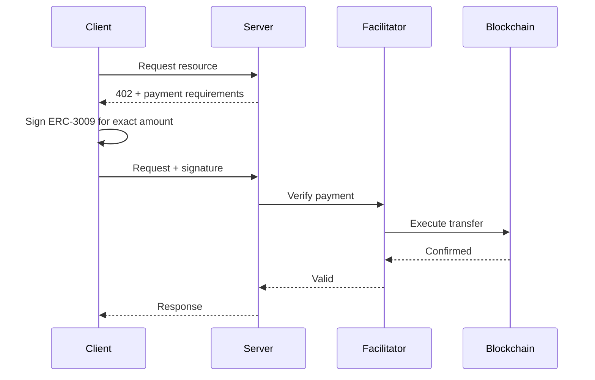
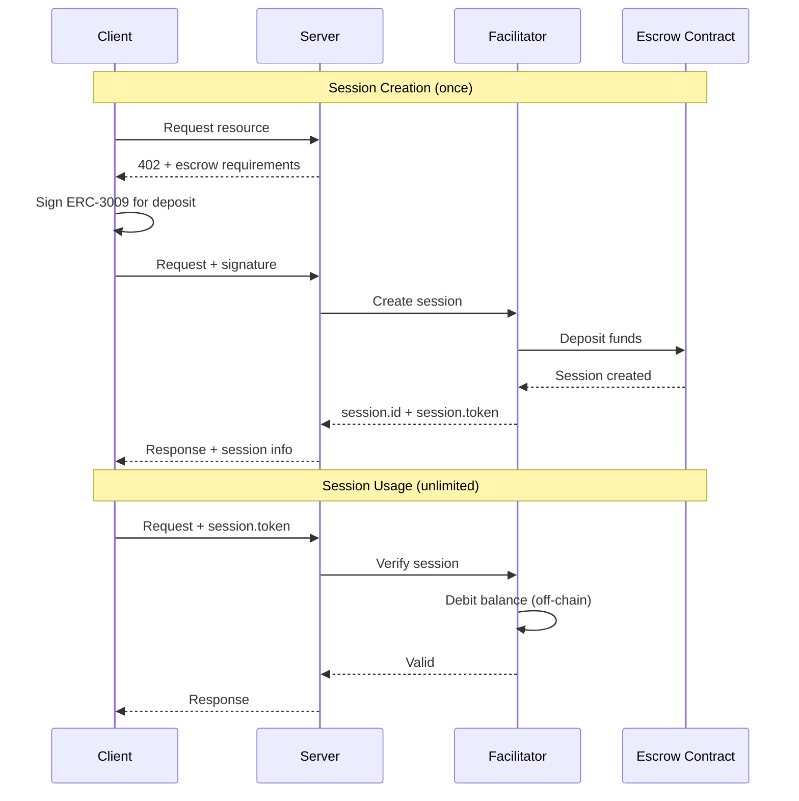

# Payment Schemes

The facilitator supports two x402 payment schemes: `exact` and `escrow`. Understanding when to use each is key to building efficient applications.

## Overview

<CardGroup cols={2}>
  <Card title="exact" icon="receipt">
    Standard x402 per-request payments using ERC-3009
  </Card>
  <Card title="escrow" icon="vault">
    Session-based payments with pre-deposited funds
  </Card>
</CardGroup>

---

## Exact Scheme

The `exact` scheme is the standard x402 payment method. Each API request requires a fresh ERC-3009 signature authorizing the exact payment amount.

### How It Works



### Characteristics

| Property | Value |
| -------- | ----- |
| Signatures | 1 per request |
| Gas | Per request (ERC-3009 transfer) |
| Latency | Higher (blockchain confirmation) |
| Pre-deposit | None required |
| Unused funds | N/A (exact amounts) |

### When to Use

- **Infrequent calls**: < 10 API calls per day
- **Variable pricing**: Each request has different cost
- **No pre-commitment**: Don't want to lock up funds
- **Simple integration**: Minimal state management

### Server Configuration

```typescript
import { paymentMiddleware } from '@x402/express';

app.use(paymentMiddleware({
  'GET /api/endpoint': {
    accepts: {
      scheme: 'exact',
      price: '$0.10',
      network: 'eip155:8453',
      payTo: '0xYourAddress...',
    },
  },
}, server));
```

### Client Usage

```typescript
import { useWalletClient } from 'wagmi';
import { wrapFetchWithPayment } from '@x402/fetch';
import { x402Client } from '@x402/core/client';

const { data: walletClient } = useWalletClient();

if (walletClient) {
  const x402 = new x402Client(walletClient);
  const paidFetch = wrapFetchWithPayment(fetch, x402);

  // User signs each request
  const response = await paidFetch('https://api.example.com/endpoint');
}
```

<Note>
The `exact` scheme requires user signature per request - best for browser dApps.
</Note>

---

## Escrow Scheme

The `escrow` scheme enables session-based payments. Users deposit funds once and make unlimited API calls without additional signatures.

### How It Works



### Characteristics

| Property | Value |
| -------- | ----- |
| Signatures | 1 per session (not per request) |
| Gas | Only on session creation |
| Latency | Instant (off-chain verification) |
| Pre-deposit | $5 - $100 USDC |
| Unused funds | 100% reclaimable |

### When to Use

- **High-frequency calls**: 100s-1000s of API calls
- **AI agents**: Autonomous operations without user prompts
- **Low latency**: Real-time applications
- **Predictable billing**: Session-based budgets

### Server Configuration

```typescript
import { paymentMiddleware } from '@x402/express';
import { EscrowScheme } from '@agentokratia/x402-escrow/server';

const server = new x402ResourceServer(facilitator)
  .register('eip155:8453', new EscrowScheme());

app.use(paymentMiddleware({
  'GET /api/endpoint': {
    accepts: {
      scheme: 'escrow',
      price: '$0.01',
      network: 'eip155:8453',
      payTo: '0xYourAddress...',
    },
  },
}, server));
```

### Client Usage

<CodeGroup>

```typescript Browser (wagmi)
import { useWalletClient } from 'wagmi';
import { createEscrowFetch } from '@agentokratia/x402-escrow/client';

const { data: walletClient } = useWalletClient();

if (walletClient) {
  const { fetch: escrowFetch } = createEscrowFetch(walletClient, {
    depositAmount: '10000000', // $10 USDC
    storage: 'localStorage',
  });

  // First call creates session
  const response1 = await escrowFetch('https://api.example.com/endpoint');

  // Subsequent calls reuse session (instant, no signature)
  const response2 = await escrowFetch('https://api.example.com/endpoint');
}
```

```typescript Node.js
import { createWalletClient, http } from 'viem';
import { privateKeyToAccount } from 'viem/accounts';
import { base } from 'viem/chains';
import { createEscrowFetch } from '@agentokratia/x402-escrow/client';

const walletClient = createWalletClient({
  account: privateKeyToAccount(process.env.PRIVATE_KEY as `0x${string}`),
  chain: base,
  transport: http(),
});

const { fetch: escrowFetch } = createEscrowFetch(walletClient, {
  depositAmount: '10000000', // $10 USDC
});

// First call creates session
const response1 = await escrowFetch('https://api.example.com/endpoint');

// Subsequent calls reuse session (instant, no signature)
const response2 = await escrowFetch('https://api.example.com/endpoint');
```

</CodeGroup>

### Session Lifecycle

1. **Creation**: User signs ERC-3009, facilitator deposits to escrow contract
2. **Active**: Session has balance, requests debit from it
3. **Depleted**: Balance exhausted, new session needed
4. **Expired**: Past expiry time, funds reclaimable
5. **Reclaimed**: User withdrew remaining balance

<Info>
Sessions are scoped to `(user, payTo, network)`. Different APIs from the same provider share a session.
</Info>

---

## Accepting Both Schemes

Servers can accept both schemes, letting clients choose:

```typescript
app.use(paymentMiddleware({
  'GET /api/endpoint': {
    accepts: [
      // Prefer escrow for high-frequency
      { scheme: 'escrow', price: '$0.01', network: 'eip155:8453', payTo: '0x...' },
      // Fall back to exact for one-off
      { scheme: 'exact', price: '$0.01', network: 'eip155:8453', payTo: '0x...' },
    ],
  },
}, server));
```

The facilitator will use the first matching scheme the client supports.

---

## Comparison Summary

| Aspect | `exact` | `escrow` |
| ------ | ------- | -------- |
| **UX** | Sign every request | Sign once |
| **Speed** | Slower (on-chain) | Instant |
| **Cost** | Gas per request | Gas once |
| **Commitment** | None | Pre-deposit |
| **Refunds** | N/A | Reclaimable |
| **Complexity** | Simple | Sessions to manage |
| **AI Agents** | Poor fit | Ideal |

<CardGroup cols={2}>
  <Card title="Sessions Deep Dive" icon="clock" href="/concepts/sessions">
    Learn more about escrow session lifecycle
  </Card>
  <Card title="Settlement" icon="arrow-right-arrow-left" href="/concepts/settlement">
    How payments are settled on-chain
  </Card>
</CardGroup>
