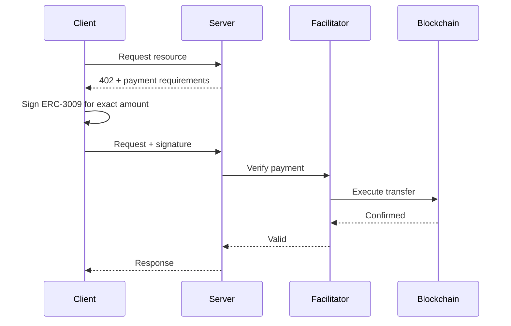
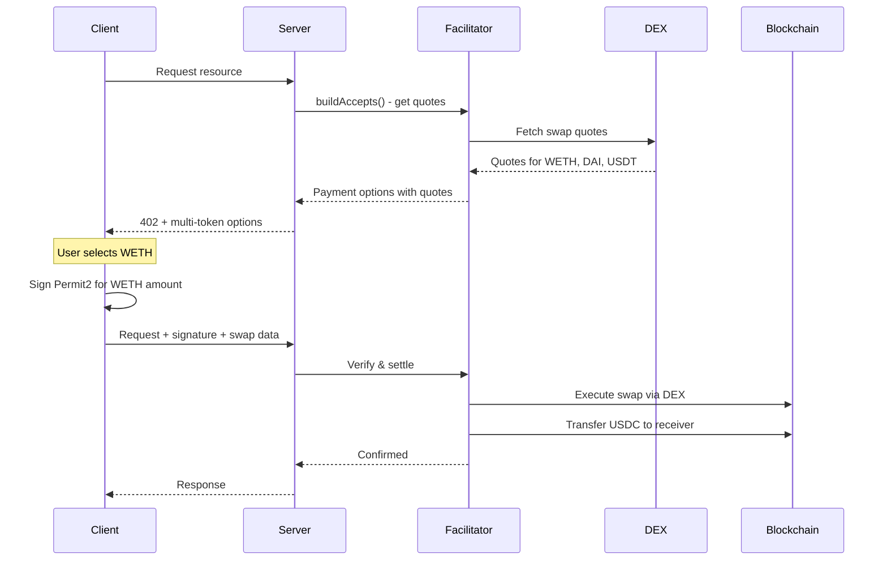

# Payment Schemes

The facilitator supports two x402 payment schemes: `exact` and `escrow`. Understanding when to use each is key to building efficient applications.

## Overview

<CardGroup cols={2}>
  <Card title="exact" icon="receipt">
    Standard x402 per-request payments. USDC only.
  </Card>
  <Card title="escrow" icon="vault">
    Multi-token payments with automatic swaps. Pay with any token, receiver gets USDC.
  </Card>
</CardGroup>

---

## Exact Scheme

The `exact` scheme is the standard x402 payment method. Each API request requires an ERC-3009 signature authorizing the exact USDC payment amount.

### How It Works



### Characteristics

| Property | Value |
| -------- | ----- |
| Input token | USDC only |
| Signature type | ERC-3009 `transferWithAuthorization` |
| Gas for user | None (gasless) |
| Settlement | Direct USDC transfer |

### When to Use

- **USDC holders**: Users already have USDC
- **Simple integration**: No swap complexity
- **Predictable costs**: Exact amounts, no slippage

### Server Configuration

```typescript
import { x402ResourceServer, HTTPFacilitatorClient } from '@x402/core/server';
import { ExactEvmScheme } from '@x402/evm/exact/server';
import { paymentMiddleware } from '@x402/express';

const facilitator = new HTTPFacilitatorClient({
  url: 'https://facilitator.agentokratia.com',
  createAuthHeaders: async () => ({
    verify: { Authorization: `Bearer ${process.env.X402_API_KEY}` },
    settle: { Authorization: `Bearer ${process.env.X402_API_KEY}` },
  }),
});

const server = new x402ResourceServer(facilitator)
  .register('eip155:8453', new ExactEvmScheme());

app.use(paymentMiddleware({
  'GET /api/endpoint': {
    accepts: {
      scheme: 'exact',
      price: '$0.10',
      network: 'eip155:8453',
      payTo: '0xYourAddress...',
    },
  },
}, server));
```

### Client Usage

```typescript
import { wrapFetchWithPayment, x402Client } from '@x402/fetch';
import { ExactEvmScheme } from '@x402/evm/exact/client';
import { privateKeyToAccount } from 'viem/accounts';

const account = privateKeyToAccount(process.env.PRIVATE_KEY);

const client = new x402Client()
  .register('eip155:8453', new ExactEvmScheme(account));

const paidFetch = wrapFetchWithPayment(fetch, client);

const response = await paidFetch('https://api.example.com/endpoint');
```

---

## Escrow Scheme

The `escrow` scheme enables multi-token payments. Users can pay with WETH, DAI, USDT, or USDC. The facilitator automatically swaps non-USDC tokens to USDC before paying the receiver.

### How It Works



### Characteristics

| Property | Value |
| -------- | ----- |
| Input tokens | USDC, WETH, DAI, USDT |
| Output token | Always USDC (to receiver) |
| Signature type | ERC-3009 (USDC) or Permit2 (other tokens) |
| Gas for user | None (gasless) |
| DEX aggregators | Uniswap, Paraswap, OpenOcean |

### When to Use

- **Multi-token support**: Accept payments in any supported token
- **Better UX**: Users don't need to swap to USDC first
- **AI agents**: Agents can pay with whatever token they hold

### Server Configuration

```typescript
import { x402ResourceServer, HTTPFacilitatorClient } from '@x402/core/server';
import { ExactEvmScheme } from '@x402/evm/exact/server';
import { EscrowScheme } from '@agentokratia/x402-escrow/server';
import { paymentMiddleware } from '@x402/express';

const facilitator = new HTTPFacilitatorClient({
  url: 'https://facilitator.agentokratia.com',
  createAuthHeaders: async () => ({
    verify: { Authorization: `Bearer ${process.env.X402_API_KEY}` },
    settle: { Authorization: `Bearer ${process.env.X402_API_KEY}` },
  }),
});

const escrow = new EscrowScheme({ facilitator });

const server = new x402ResourceServer(facilitator)
  .register('eip155:8453', new ExactEvmScheme())
  .register('eip155:8453', escrow);

// Auto-discovers supported tokens and fetches quotes
const escrowAccepts = await escrow.buildAccepts({
  network: 'eip155:8453',
  price: '$0.01',
  payTo: '0xYourAddress...',
});

app.use(paymentMiddleware({
  'GET /api/endpoint': {
    accepts: [
      { scheme: 'exact', price: '$0.01', network: 'eip155:8453', payTo: '0x...' },
      ...escrowAccepts, // Adds USDC, WETH, DAI, USDT options
    ],
  },
}, server));
```

<Note>
  The `buildAccepts()` method returns an array of payment options for each supported input token. Spreading `...escrowAccepts` into your accepts array enables multi-token payments.
</Note>

### Client Usage

```typescript
import { wrapFetchWithPayment, x402Client } from '@x402/fetch';
import { ExactEvmScheme } from '@x402/evm/exact/client';
import { createWalletClient, createPublicClient, http } from 'viem';
import { privateKeyToAccount } from 'viem/accounts';
import { base } from 'viem/chains';
import {
  EscrowScheme,
  createBalanceSelector,
  preferTokenPolicy,
} from '@agentokratia/x402-escrow/client';

const WETH = '0x4200000000000000000000000000000000000006';
const USDC = '0x833589fCD6eDb6E08f4c7C32D4f71b54bdA02913';

const account = privateKeyToAccount(process.env.PRIVATE_KEY);

const walletClient = createWalletClient({
  account, chain: base, transport: http(),
});

const publicClient = createPublicClient({
  chain: base, transport: http(),
});

// Balance-aware: auto-picks token you can afford
const client = new x402Client(
  createBalanceSelector(publicClient, account.address)
)
  .register('eip155:8453', new ExactEvmScheme(account))
  .register('eip155:8453', new EscrowScheme(walletClient))
  .registerPolicy(preferTokenPolicy([WETH, USDC]));

const paidFetch = wrapFetchWithPayment(fetch, client);

const response = await paidFetch('https://api.example.com/endpoint');
```

### Token Selection

The client SDK provides two ways to control which token is used:

#### Balance-Aware Selection

`createBalanceSelector` checks on-chain balances and picks the first token the user can afford:

```typescript
const client = new x402Client(
  createBalanceSelector(publicClient, account.address)
);
```

#### Token Preference Policy

`preferTokenPolicy` reorders payment options by your preferred token order:

```typescript
const client = new x402Client(
  createBalanceSelector(publicClient, account.address)
)
  .registerPolicy(preferTokenPolicy([WETH, USDC, DAI]));
```

This prefers WETH first, then USDC, then DAI.

---

## Accepting Both Schemes

Servers can accept both schemes, letting clients choose based on what tokens they hold:

```typescript
const escrow = new EscrowScheme({ facilitator });
const escrowAccepts = await escrow.buildAccepts({
  network: 'eip155:8453',
  price: '$0.01',
  payTo: '0xYourAddress...',
});

app.use(paymentMiddleware({
  'GET /api/endpoint': {
    accepts: [
      { scheme: 'exact', price: '$0.01', network: 'eip155:8453', payTo: '0x...' },
      ...escrowAccepts,
    ],
  },
}, server));
```

The client will automatically select the best option based on:
1. Token balances (via `createBalanceSelector`)
2. Token preferences (via `preferTokenPolicy`)

---

## Comparison Summary

| Aspect | `exact` | `escrow` |
| ------ | ------- | -------- |
| **Input tokens** | USDC only | USDC, WETH, DAI, USDT |
| **Signature** | ERC-3009 | ERC-3009 or Permit2 |
| **Gas for user** | None | None |
| **Swap needed** | No | Yes (for non-USDC) |
| **Slippage** | None | ~0.5% (configurable) |
| **Complexity** | Simple | More setup |
| **Best for** | USDC holders | Multi-token flexibility |

<CardGroup cols={2}>
  <Card title="Server Guide" icon="server" href="/x402/integration/server">
    Full server integration guide
  </Card>
  <Card title="Client Guide" icon="laptop" href="/x402/integration/client">
    Full client SDK documentation
  </Card>
</CardGroup>
