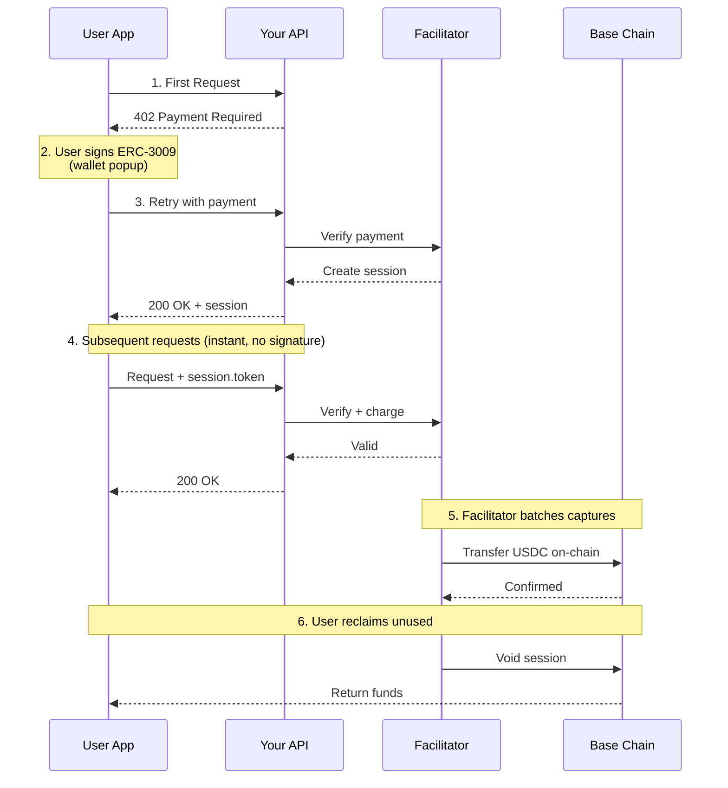
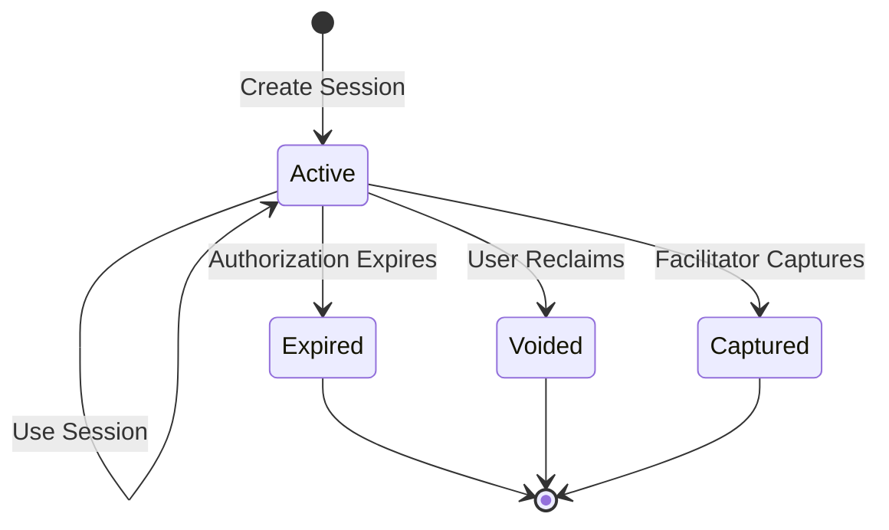

# Sessions

Sessions are the core concept of x402 escrow payments. They allow users to authorize a deposit once and make many API calls without additional signatures or gas fees.

## Architecture Overview



<Note>
  User only signs **once** (step 2). All subsequent requests (step 4) are instant with no wallet interaction.
</Note>

## Overview

A session represents a pre-authorized pool of funds that can be used for multiple API calls:

| Property | Description |
| -------- | ----------- |
| **Deposit** | One-time ERC-3009 authorization |
| **Usage** | Off-chain, instant, no gas |
| **Balance** | Tracked by facilitator |
| **Reclaim** | Available anytime |

## Session Lifecycle



### States

| State | Description |
| ----- | ----------- |
| `active` | Session is usable, balance available |
| `expired` | Authorization period ended |
| `voided` | User reclaimed remaining funds |
| `captured` | All funds captured by receiver |

## Session Creation Payload

When creating a session, the client sends:

```typescript
{
  x402Version: 2,
  accepted: PaymentRequirements,  // Echo back accepted requirements
  payload: {
    signature: string,            // ERC-3009 transferWithAuthorization signature
    authorization: {
      from: string,               // Payer wallet address
      to: string,                 // Token collector address
      value: string,              // Deposit amount in atomic units
      validAfter: string,         // "0" (immediate validity)
      validBefore: string,        // Unix timestamp as string
      nonce: string,              // Computed from escrow parameters
    },
    sessionParams: {
      salt: string,               // Random bytes32 hex
      authorizationExpiry: number, // Unix timestamp
      refundExpiry: number,       // Unix timestamp
    },
    requestId: string,            // UUID for idempotency
  },
}
```

## Session Usage Payload

For subsequent requests, the client sends:

```typescript
{
  x402Version: 2,
  accepted: PaymentRequirements,
  payload: {
    session: {
      id: string,             // From creation response
      token: string,          // SECRET from creation response
    },
    requestId: string,        // Idempotency key
    amount: string,           // Payment amount for this request
  },
}
```

## Session Token

The session token is a critical security component:

<Warning>
  The session token is returned **only once** at creation. Store it securely - it cannot be retrieved again.
</Warning>

- 256-bit cryptographically random value
- Stored as bcrypt hash by facilitator
- Required for all session operations
- Prevents unauthorized session access

## Balance Tracking

Session balances are tracked with four values:

| Balance | Description |
| ------- | ----------- |
| `authorized` | Total deposit amount |
| `captured` | Already transferred to receiver |
| `pending` | Owed to receiver, not yet captured |
| `available` | Can be used for new requests |

**Formula:** `available = authorized - captured - pending`

## Example Flow

<Steps>
  <Step title="User deposits $10 USDC">
    Signs ERC-3009 authorization for $10
  </Step>
  <Step title="Session created">
    `authorized: $10, available: $10`
  </Step>
  <Step title="API call for $0.05">
    `available: $9.95, pending: $0.05`
  </Step>
  <Step title="More API calls">
    `available: $8.00, pending: $2.00`
  </Step>
  <Step title="Facilitator batch captures">
    `available: $8.00, captured: $2.00, pending: $0`
  </Step>
  <Step title="User reclaims">
    Receives $8.00 back, receiver got $2.00
  </Step>
</Steps>

## Session Selection

When you call `escrowFetch(url)`, the SDK automatically selects which session to use:

### Selection Algorithm

```
1. Find all sessions for the target receiver (payTo address)
2. Filter to only "active" sessions (not expired, voided, or captured)
3. Filter to sessions with balance >= required amount
4. Select the session with the HIGHEST available balance
5. If no valid session found → create new session (triggers wallet signature)
```

### Examples

```typescript
// Scenario: User has 3 sessions to api.example.com
// Session A: $5.00 balance
// Session B: $2.00 balance
// Session C: $0.50 balance

// Request costs $0.01
await escrowFetch('https://api.example.com/premium');
// → Uses Session A ($5.00 - highest balance)

// Request costs $3.00
await escrowFetch('https://api.example.com/expensive');
// → Uses Session A (only one with enough balance)

// Request costs $10.00
await escrowFetch('https://api.example.com/bulk');
// → Creates NEW session (no existing session has $10)
// → User sees wallet signature popup
```

### Forcing Session Behavior

```typescript
// Auto-select (default)
await escrowFetch(url);
await escrowFetch(url, { session: 'auto' });

// Force new session (ignores existing sessions)
await escrowFetch(url, { session: 'new' });

// Use specific session by ID
await escrowFetch(url, { session: 'session-abc-123' });
```

<Note>
  When forcing a specific session with insufficient balance, the request will fail with `insufficient_balance` error.
</Note>

### Multiple APIs, Multiple Sessions

Sessions are scoped to the **receiver address** (`payTo`), not the URL:

```typescript
// These use the SAME session pool (same payTo address)
await escrowFetch('https://api.example.com/endpoint-a');
await escrowFetch('https://api.example.com/endpoint-b');

// This uses a DIFFERENT session pool (different payTo address)
await escrowFetch('https://other-api.com/endpoint');
```

### Storage Behavior

| Storage | Behavior |
|---------|----------|
| `'memory'` (default) | Sessions lost on page refresh/app restart |
| `'localStorage'` | Sessions persist across page reloads |

```typescript
// Persist sessions across browser sessions
const { fetch: escrowFetch } = createEscrowFetch(walletClient, {
  storage: 'localStorage',
});
```

<Warning>
  With `'memory'` storage, users will need to sign a new session after every page refresh. Use `'localStorage'` for better UX in browser apps.
</Warning>
