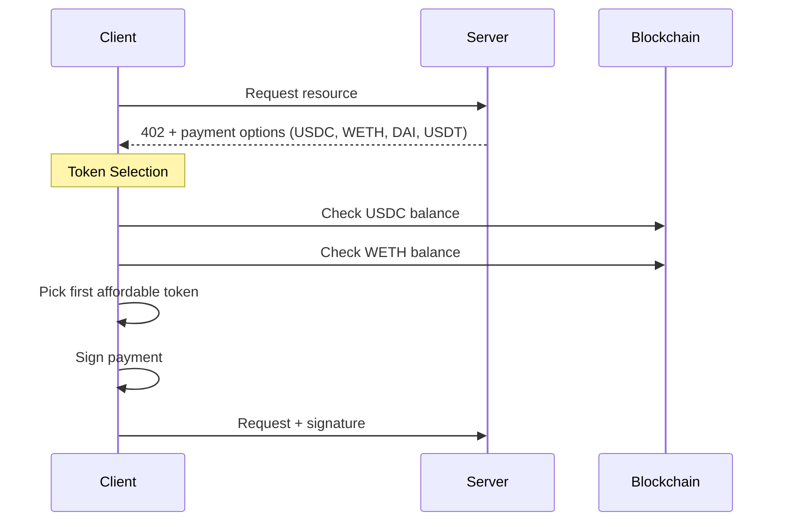

# Token Selection

When a server accepts multiple tokens (via the escrow scheme), clients need to choose which token to use for payment. The SDK provides automatic selection based on balances and preferences.

## Overview



## Selection Strategies

### Balance-Aware Selection (Recommended)

Use `createBalanceSelector` to automatically check on-chain balances and pick the first token the user can afford:

```typescript
import { wrapFetchWithPayment, x402Client } from '@x402/fetch';
import { ExactEvmScheme } from '@x402/evm/exact/client';
import { createWalletClient, createPublicClient, http } from 'viem';
import { privateKeyToAccount } from 'viem/accounts';
import { base } from 'viem/chains';
import {
  EscrowScheme,
  createBalanceSelector,
} from '@agentokratia/x402-escrow/client';

const account = privateKeyToAccount(process.env.PRIVATE_KEY);

const walletClient = createWalletClient({
  account, chain: base, transport: http(),
});

const publicClient = createPublicClient({
  chain: base, transport: http(),
});

// Balance-aware selection
const client = new x402Client(
  createBalanceSelector(publicClient, account.address)
)
  .register('eip155:8453', new ExactEvmScheme(account))
  .register('eip155:8453', new EscrowScheme(walletClient));

const paidFetch = wrapFetchWithPayment(fetch, client);
```

### Token Preference Policy

Use `preferTokenPolicy` to set a preferred order. Combined with balance checking, the client will use your preferred token if the user can afford it:

```typescript
import { preferTokenPolicy } from '@agentokratia/x402-escrow/client';

const WETH = '0x4200000000000000000000000000000000000006';
const USDC = '0x833589fCD6eDb6E08f4c7C32D4f71b54bdA02913';
const DAI = '0x50c5725949a6f0c72e6c4a641f24049a917db0cb';

const client = new x402Client(
  createBalanceSelector(publicClient, account.address)
)
  .register('eip155:8453', new ExactEvmScheme(account))
  .register('eip155:8453', new EscrowScheme(walletClient))
  .registerPolicy(preferTokenPolicy([WETH, USDC, DAI]));
```

This configuration:
1. Reorders payment options to prefer WETH first, then USDC, then DAI
2. Checks balances for each in order
3. Picks the first one the user can afford

### Manual Balance Checking

For custom logic, use `checkBalance` directly:

```typescript
import { checkBalance } from '@agentokratia/x402-escrow/client';

const USDC = '0x833589fCD6eDb6E08f4c7C32D4f71b54bdA02913';
const requiredAmount = BigInt('1000000'); // $1 USDC

const canAfford = await checkBalance(
  publicClient,
  account.address,
  USDC,
  requiredAmount
);

if (canAfford) {
  console.log('User can pay with USDC');
} else {
  console.log('User needs more USDC');
}
```

## Selection Algorithm

When `createBalanceSelector` is used, the selection works as follows:

```
1. Receive payment options from server (e.g., USDC, WETH, DAI, USDT)
2. Apply preferTokenPolicy (if registered) to reorder options
3. For each option in order:
   a. Check on-chain balance
   b. If balance >= required amount, select this token
4. If no token has sufficient balance, throw error
```

## Example Scenarios

### Scenario 1: User has USDC only

```
Server offers: [USDC, WETH, DAI, USDT]
User balances: USDC=$50, WETH=0, DAI=0, USDT=0
Required: $1

Result: USDC selected (first with sufficient balance)
```

### Scenario 2: User has WETH, prefers it

```
Server offers: [USDC, WETH, DAI, USDT]
Policy: preferTokenPolicy([WETH, USDC])
After reorder: [WETH, USDC, DAI, USDT]
User balances: USDC=$50, WETH=$100, DAI=0, USDT=0
Required: $1

Result: WETH selected (preferred and has balance)
```

### Scenario 3: User prefers WETH but doesn't have enough

```
Server offers: [USDC, WETH, DAI, USDT]
Policy: preferTokenPolicy([WETH, USDC])
After reorder: [WETH, USDC, DAI, USDT]
User balances: USDC=$50, WETH=$0.50, DAI=0, USDT=0
Required: $1

Result: USDC selected (WETH insufficient, falls back to USDC)
```

## Browser vs Node.js

### Browser (with wagmi)

```typescript
import { useWalletClient, usePublicClient, useAccount } from 'wagmi';
import { wrapFetchWithPayment, x402Client } from '@x402/fetch';
import { ExactEvmScheme } from '@x402/evm/exact/client';
import {
  EscrowScheme,
  createBalanceSelector,
} from '@agentokratia/x402-escrow/client';

function PaymentComponent() {
  const { data: walletClient } = useWalletClient();
  const publicClient = usePublicClient();
  const { address } = useAccount();

  const pay = async () => {
    if (!walletClient || !publicClient || !address) return;

    const signer = {
      address,
      signTypedData: (msg) => walletClient.signTypedData({
        account: walletClient.account,
        ...msg
      }),
    };

    const client = new x402Client(
      createBalanceSelector(publicClient, address)
    )
      .register('eip155:8453', new ExactEvmScheme(signer))
      .register('eip155:8453', new EscrowScheme(walletClient));

    const paidFetch = wrapFetchWithPayment(fetch, client);
    const response = await paidFetch('https://api.example.com/premium');
  };

  return <button onClick={pay}>Pay</button>;
}
```

### Node.js (with private key)

```typescript
import { wrapFetchWithPayment, x402Client } from '@x402/fetch';
import { ExactEvmScheme } from '@x402/evm/exact/client';
import { createWalletClient, createPublicClient, http } from 'viem';
import { privateKeyToAccount } from 'viem/accounts';
import { base } from 'viem/chains';
import {
  EscrowScheme,
  createBalanceSelector,
  preferTokenPolicy,
} from '@agentokratia/x402-escrow/client';

const WETH = '0x4200000000000000000000000000000000000006';
const USDC = '0x833589fCD6eDb6E08f4c7C32D4f71b54bdA02913';

const account = privateKeyToAccount(process.env.PRIVATE_KEY);

const walletClient = createWalletClient({
  account, chain: base, transport: http(),
});

const publicClient = createPublicClient({
  chain: base, transport: http(),
});

const client = new x402Client(
  createBalanceSelector(publicClient, account.address)
)
  .register('eip155:8453', new ExactEvmScheme(account))
  .register('eip155:8453', new EscrowScheme(walletClient))
  .registerPolicy(preferTokenPolicy([WETH, USDC]));

const paidFetch = wrapFetchWithPayment(fetch, client);

const response = await paidFetch('https://api.example.com/premium');
```

## API Reference

### createBalanceSelector

```typescript
function createBalanceSelector(
  publicClient: PublicClient,
  address: Address
): AsyncAcceptSelector;
```

Creates an async selector that checks on-chain token balances.

### preferTokenPolicy

```typescript
function preferTokenPolicy(
  tokens: Address[]
): SyncAcceptPolicy;
```

Creates a sync policy that reorders payment options by token preference.

### checkBalance

```typescript
function checkBalance(
  publicClient: PublicClient,
  address: Address,
  token: Address,
  amount: bigint
): Promise<boolean>;
```

Checks if an address has at least `amount` of the specified token.

<CardGroup cols={2}>
  <Card title="Payment Schemes" icon="code-compare" href="/x402/concepts/schemes">
    Learn about exact vs escrow schemes
  </Card>
  <Card title="Client Guide" icon="laptop" href="/x402/integration/client">
    Full client SDK documentation
  </Card>
</CardGroup>
