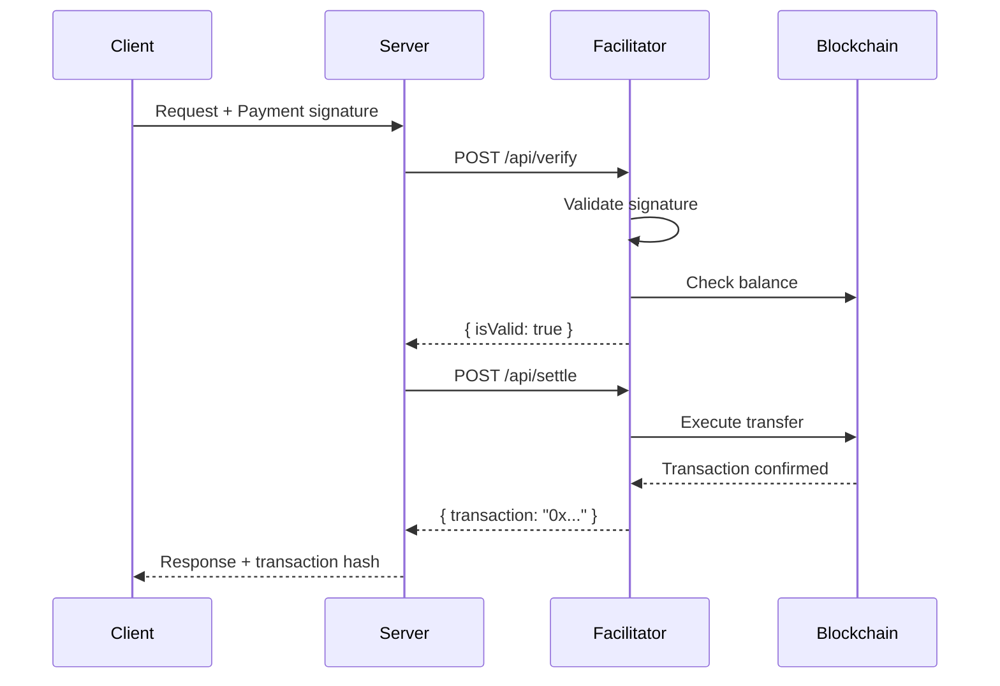
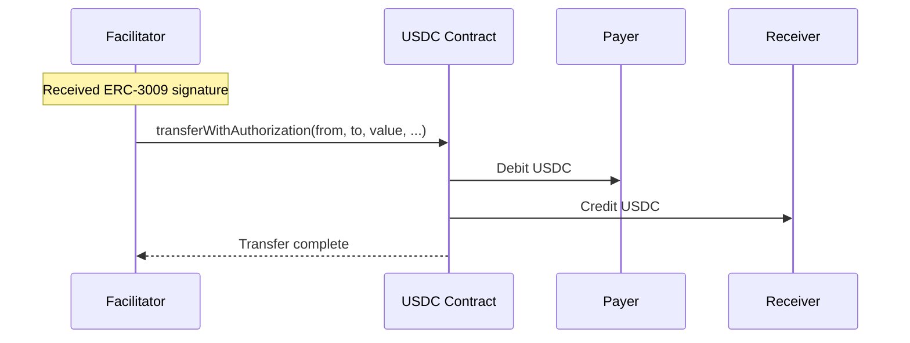
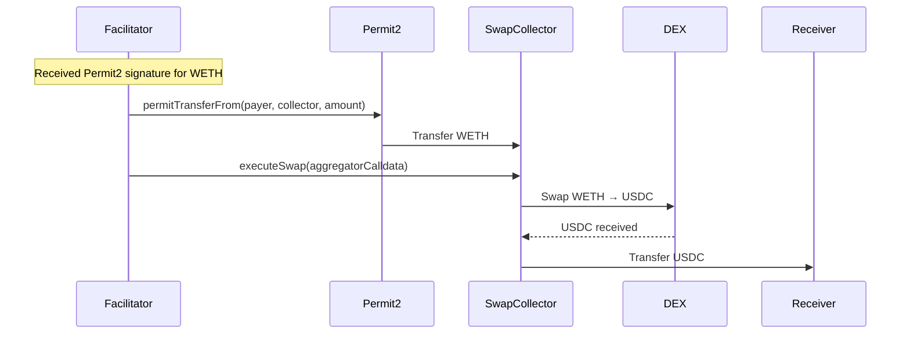

# Settlement

Settlement is the process of verifying a payment signature and executing the on-chain transfer. The facilitator handles this automatically.

## Overview

When a client submits a payment, the facilitator:
1. **Verifies** the signature is valid and the user has sufficient balance
2. **Settles** by executing the on-chain transfer



## Exact vs Escrow Settlement

<CardGroup cols={2}>
  <Card title="Exact Scheme" icon="arrow-right">
    **Direct USDC Transfer**

    - ERC-3009 `transferWithAuthorization`
    - Direct transfer from payer to receiver
    - Single on-chain transaction
  </Card>
  <Card title="Escrow Scheme" icon="arrows-rotate">
    **Swap + Transfer**

    - Permit2 signature (for non-USDC tokens)
    - DEX swap to USDC
    - Transfer USDC to receiver
  </Card>
</CardGroup>

## Exact Scheme Settlement

For USDC payments using the `exact` scheme:



The facilitator calls `transferWithAuthorization` on the USDC contract using the payer's signature. This is gasless for the payer.

## Escrow Scheme Settlement (Swap)

For non-USDC payments using the `escrow` scheme:



The flow:
1. Permit2 transfers the input token (e.g., WETH) to the SwapCollector contract
2. SwapCollector executes the swap via a DEX aggregator (Uniswap, Paraswap, or OpenOcean)
3. SwapCollector transfers the resulting USDC to the receiver

## Signature Types

### ERC-3009 (USDC)

Used for direct USDC transfers. The payer signs a `transferWithAuthorization` message:

```typescript
{
  from: "0xPayer...",
  to: "0xReceiver...",
  value: "1000000", // $1 USDC
  validAfter: "0",
  validBefore: "1699999999",
  nonce: "0x..."
}
```

### Permit2 (Other Tokens)

Used for WETH, DAI, USDT transfers. The payer signs a Permit2 transfer:

```typescript
{
  permitted: {
    token: "0xWETH...",
    amount: "500000000000000000" // 0.5 WETH
  },
  spender: "0xSwapCollector...",
  nonce: "0x...",
  deadline: "1699999999"
}
```

## Nonce Management

Each payment has a unique nonce to prevent replay attacks.

### ERC-3009 Nonces

Derived deterministically from payment parameters:

```typescript
import { computePaymentNonce } from '@agentokratia/x402-escrow/client';

const nonce = computePaymentNonce({
  payer: "0xPayer...",
  receiver: "0xReceiver...",
  amount: "1000000",
  validBefore: 1699999999,
});
```

### Permit2 Nonces

Also derived deterministically, ensuring each payment can only be settled once.

## Idempotency

The facilitator enforces idempotency:

- Each signature can only be settled **once**
- Retrying with the same signature returns the cached result
- No risk of double-charging

```typescript
// These two calls result in only ONE on-chain transfer
await paidFetch(url); // First call: settles payment
await paidFetch(url); // Retry: returns cached result (if same signature)
```

## Gas Costs

| Operation | Gas (approx) | Who Pays |
| --------- | ------------ | -------- |
| ERC-3009 transfer | ~65k | Facilitator |
| Permit2 + swap | ~150k-250k | Facilitator |

<Note>
  Gas costs are covered by the facilitator. Users pay $0 in gas.
</Note>

## Settlement Response

After successful settlement, the facilitator returns:

```json
{
  "success": true,
  "transaction": "0x...",
  "network": "eip155:8453"
}
```

The `transaction` field contains the on-chain transaction hash, which can be verified on a block explorer.

## Error Handling

Common settlement errors:

| Error | Cause | Solution |
| ----- | ----- | -------- |
| `insufficient_balance` | Payer doesn't have enough tokens | Check balance before signing |
| `signature_invalid` | Signature verification failed | Ensure correct signing parameters |
| `nonce_already_used` | Payment already settled | Idempotent - same result returned |
| `quote_expired` | Swap quote expired | Retry with fresh quote |
| `swap_failed` | DEX swap reverted | Check slippage settings |

## Supported DEX Aggregators

For swap payments, the facilitator routes through:

| Aggregator | Type | Notes |
| ---------- | ---- | ----- |
| Uniswap UniversalRouter | Push | Best for simple swaps |
| Paraswap | Pull | Often best rates |
| OpenOcean | Pull | Good for exotic pairs |

The facilitator fetches quotes from all aggregators and uses the best available rate.

<CardGroup cols={2}>
  <Card title="Payment Schemes" icon="code-compare" href="/x402/concepts/schemes">
    Learn about exact vs escrow schemes
  </Card>
  <Card title="API Reference" icon="book" href="/x402/api-reference/settle">
    Settle API documentation
  </Card>
</CardGroup>
