# Settlement

Settlement is the process of transferring funds from the escrow to the receiver. The facilitator handles this automatically.

## Capture Strategy

The facilitator uses a batched capture strategy to minimize gas costs:

| Trigger | Action |
| ------- | ------ |
| Pending > $1 | Batch capture (cron job) |
| Expiry < 2h | Batch capture (cron job) |
| Expiry < 30min | Sync capture (per request) |

<Info>
  Captures are batched to reduce gas costs. Multiple pending amounts from different sessions are captured in a single transaction when possible.
</Info>

## Settlement Flow


## Exact vs Escrow Settlement

<CardGroup cols={2}>
  <Card title="Exact Scheme" icon="arrow-right">
    **1 transaction per request**

    - ERC-3009 `transferWithAuthorization`
    - Immediate on-chain transfer
    - Higher gas cost per call
    - Best for infrequent, high-value calls
  </Card>
  <Card title="Escrow Scheme" icon="layer-group">
    **1 transaction to create session**

    - Session creation: 1 tx
    - Session usage: 0 tx (off-chain)
    - Batch capture: amortized gas
    - Best for frequent, low-value calls
  </Card>
</CardGroup>

## Session Timeline

Each session has two critical timestamps:


| Timestamp | Default | Meaning |
|-----------|---------|---------|
| `authorizationExpiry` | +1 hour | Deadline for facilitator to capture |
| `refundExpiry` | +25 hours | Only affects `refund()` function (for captured amounts) |

<Note>
  `refundExpiry` does NOT affect reclaim. The payer can call `reclaim()` on the contract anytime after `authorizationExpiry` - there is no upper time limit.
</Note>

## Who Can Do What, When

<Warning>
  **Critical:** If the facilitator doesn't capture pending amounts before `authorizationExpiry`, those funds are **forfeited** - the receiver loses them and the user can reclaim the full remaining balance.
</Warning>

### Before `authorizationExpiry`

| Actor | Can Do | How |
|-------|--------|-----|
| **Facilitator** | Capture pending amounts | Automatic (cron job) |
| **User** | Reclaim unused funds | API: `POST /api/payer/sessions/{id}/reclaim` |

When user reclaims via API:
1. Facilitator captures any pending amount first → receiver gets paid
2. Facilitator voids remaining → user gets refund

### After `authorizationExpiry`

| Actor | Can Do | How |
|-------|--------|-----|
| **Facilitator** | ❌ Cannot capture | Authorization expired |
| **User** | Reclaim ALL remaining | API or direct contract call |

When user reclaims after auth expiry:
1. Pending amounts are **forfeited** (receiver loses them)
2. User gets back: `authorized - captured` (everything not yet captured)

<Info>
  The reclaim API works both before and after `authorizationExpiry`. The difference is that after expiry, the facilitator cannot capture pending amounts first - they are forfeited.
</Info>

## Reclaim API

```bash
POST /api/payer/sessions/{id}/reclaim
Authorization: Bearer <JWT>
```

**Response (before auth expiry):**
```json
{
  "success": true,
  "reclaimedAmount": "8000000",  // $8 returned to user
  "capturedAmount": "2000000",   // $2 captured for receiver
  "voidTxHash": "0x...",
  "captureTxHash": "0x..."
}
```

**Response (after auth expiry):**
```json
{
  "success": true,
  "reclaimedAmount": "10000000", // Full $10 returned (pending forfeited)
  "capturedAmount": "0",
  "voidTxHash": "0x..."
}
```

<Note>
  The reclaim API works both before and after `authorizationExpiry`. Before expiry, it captures pending amounts first (receiver gets paid). After expiry, pending amounts are forfeited and you get back everything not yet captured.
</Note>

## Balance Visualization

Understanding how a session balance changes over time ($10 deposit example):

<Steps>
  <Step title="Initial - After session creation">
    ```mermaid
    pie showData
        title Session Balance
        "Available $10.00" : 100
    ```
    Full deposit is available for API calls.
  </Step>

  <Step title="After API calls - Spent $2.50">
    ```mermaid
    pie showData
        title Session Balance
        "Available $7.50" : 75
        "Pending $2.50" : 25
    ```
    **Pending** = owed to receiver, not yet on-chain.
  </Step>

  <Step title="After batch capture">
    ```mermaid
    pie showData
        title Session Balance
        "Available $7.50" : 75
        "Captured $2.50" : 25
    ```
    Facilitator captured pending → transferred on-chain to receiver.
  </Step>

  <Step title="After reclaim - Session closed">
    ```mermaid
    pie showData
        title Final Distribution
        "Reclaimed to User $7.50" : 75
        "Paid to Receiver $2.50" : 25
    ```
    User gets unused funds back. Session closed.
  </Step>
</Steps>

<Tip>
  **Available** = can be spent on API calls. **Pending** = owed to receiver, not yet on-chain. **Captured** = transferred on-chain to receiver.
</Tip>

## Gas Costs

| Operation | Gas (approx) | Who Pays |
| --------- | ------------ | -------- |
| Session creation | ~150k | Facilitator |
| Batch capture | ~80k per session | Facilitator |
| Reclaim (via API) | ~100k | Facilitator |
| Reclaim (direct) | ~80k | User |

<Note>
  Gas costs are covered by the facilitator and factored into the service fee.
</Note>

## Refund vs Reclaim

These are two different contract functions - don't confuse them:

| Function | Purpose | Who Calls | When |
|----------|---------|-----------|------|
| `reclaim()` | Get back **uncaptured** funds | Payer | After `authorizationExpiry` |
| `refund()` | Get back **already-captured** funds | Operator (facilitator) | Before `refundExpiry` |

### Reclaim (Implemented ✅)

For unused session balance that was never captured:

```
User deposits $10 → Uses $3 → Facilitator captures $3 → User reclaims $7
```

The payer calls `reclaim()` directly on the contract after `authorizationExpiry` to get back any amount that wasn't captured.

### Refund (Not Yet Implemented 🔜)

**What is a refund?** When an API provider (receiver) voluntarily returns money they already received back to the user.

**When would you need this?**

| Scenario | Example |
|----------|---------|
| Service failure | Your API returned an error but the user was still charged |
| Goodwill gesture | User complains, you decide to refund as good customer service |
| Accidental overcharge | You charged $5 but meant to charge $0.50 |
| Partial refund | User paid for 10 API calls, only 7 worked |

<Info>
  **Receiver-initiated only.** Only the API provider (receiver) can trigger refunds. The facilitator executes the request - it does not arbitrate disputes.

  If you're a payer with a complaint, contact the API provider directly.
</Info>

**How is this different from reclaim?**

```
RECLAIM: User deposited $10, used $3, wants the unused $7 back
         → User gets back money that was NEVER captured

REFUND:  User deposited $10, used $10, API failed on a $2 call
         → Receiver gives back $2 that WAS captured (receiver already has it)
```

<Warning>
  **Not yet available via API.** The `refund()` function exists in the smart contract but the facilitator doesn't expose it yet. Coming soon.
</Warning>

#### How Refund Will Work (When Implemented)

```mermaid
sequenceDiagram
    participant Receiver as API Provider
    participant Facilitator
    participant Contract as Escrow Contract
    participant User as Payer

    Note over Receiver: Decides to refund customer
    Receiver->>Facilitator: POST /api/refund { sessionId, amount }
    Facilitator->>Facilitator: Validate amount ≤ captured
    Facilitator->>Contract: refund(paymentInfo, amount)
    Contract->>User: Transfer USDC
    Facilitator-->>Receiver: { success: true, txHash }
```



| Constraint | Value |
|------------|-------|
| Who can request | Receiver (API provider) only |
| Facilitator role | Executes only (no arbitration) |
| Max refund amount | Total captured for that session |
| Time limit | Before `refundExpiry` (default: +25 hours from session creation) |

<Note>
  After `refundExpiry`, the contract's `refund()` function is locked and refunds are no longer possible through the escrow system.
</Note>
