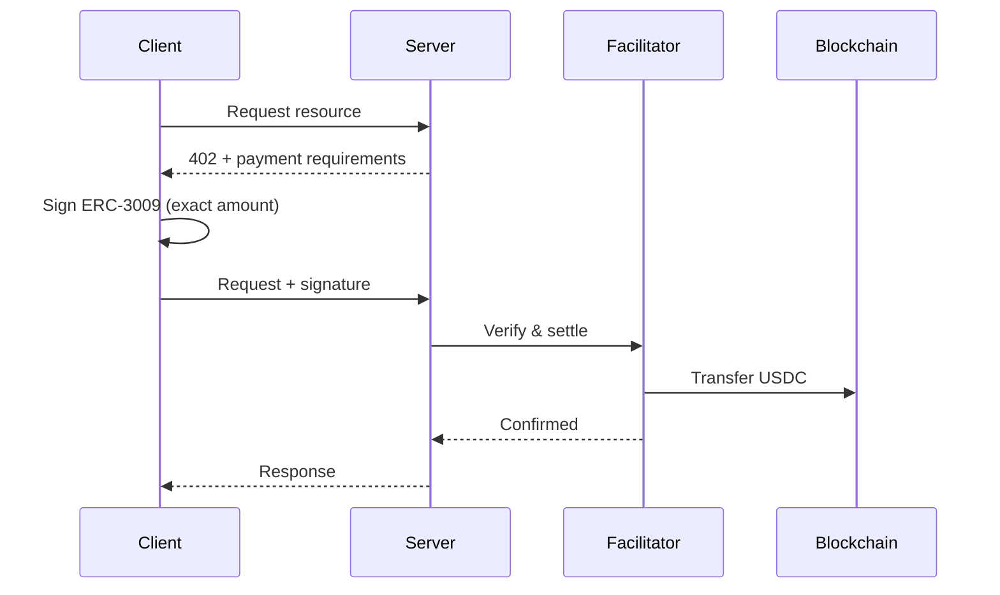
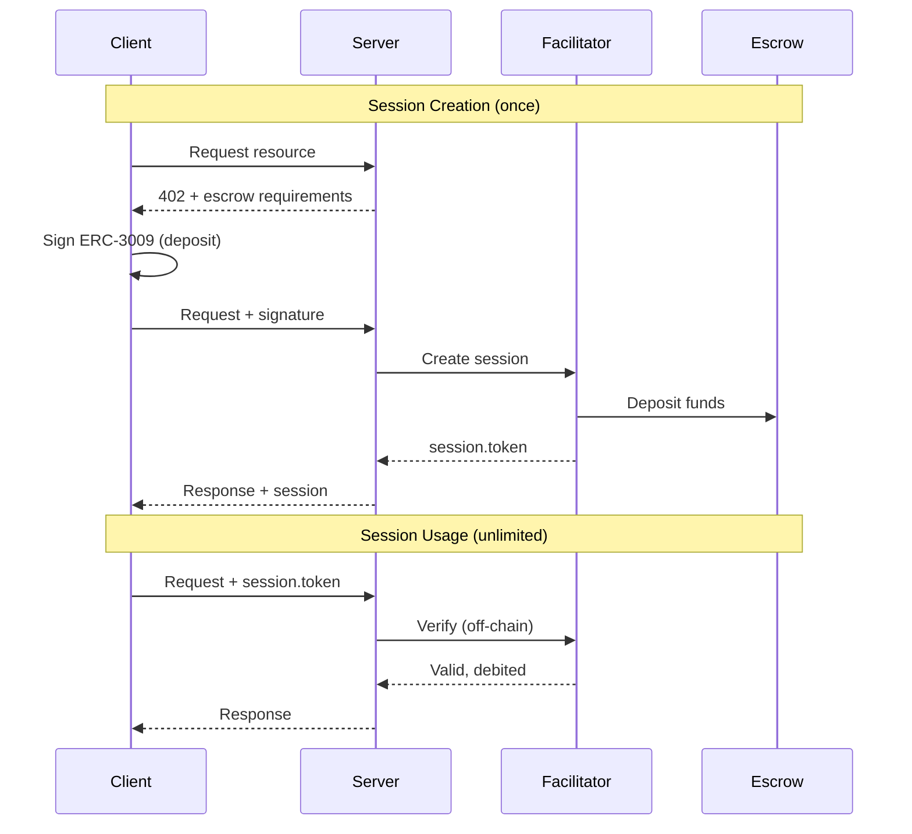

# x402 Facilitator

A production-ready x402 facilitator supporting both **exact** (per-request) and **escrow** (session-based) payment schemes.

<Info>
**What is x402?** The HTTP 402 "Payment Required" status code, finally put to use. x402 is a protocol for API monetization using blockchain payments.
</Info>

## Two Payment Schemes

<CardGroup cols={2}>
  <Card title="exact" icon="receipt" href="/x402/quickstart#exact-scheme-quickstart">
    **Per-request payments**

    Standard x402. One signature per API call. Simple, no pre-deposit needed.
  </Card>
  <Card title="escrow" icon="vault" href="/x402/quickstart#escrow-scheme-quickstart">
    **Session-based payments**

    Sign once, unlimited calls. Ideal for AI agents and high-frequency APIs.
  </Card>
</CardGroup>

### Quick Comparison

| | `exact` | `escrow` |
|---|---------|----------|
| **Signatures** | Every request | Once per session |
| **Gas costs** | Per request | Once (session creation) |
| **Latency** | Higher | Instant |
| **Pre-deposit** | No | Yes ($5-$100) |
| **Unused funds** | N/A | 100% reclaimable |
| **Best for** | Infrequent calls | AI agents, high-frequency |

<Card title="Detailed Scheme Comparison" icon="code-compare" href="/x402/concepts/schemes">
  Learn when to use each scheme
</Card>

---

## Who Is This For?

<CardGroup cols={2}>
  <Card title="Client Developers" icon="laptop" href="/x402/quickstart#client-exact">
    Building an app that pays for API calls

    - Install SDK
    - Connect wallet
    - Call paid APIs
  </Card>
  <Card title="API Providers" icon="server" href="/x402/quickstart#server-exact">
    Monetizing your API endpoints

    - Get free API key
    - Add middleware
    - Start earning
  </Card>
</CardGroup>

---

## Quick Start

### exact scheme (per-request)

```bash
npm install @x402/core @x402/fetch wagmi viem
```

<CodeGroup>

```typescript Client (Browser)
import { useWalletClient } from 'wagmi';
import { wrapFetchWithPayment } from '@x402/fetch';
import { x402Client } from '@x402/core/client';

// Get walletClient from wagmi (must have account + chain)
const { data: walletClient } = useWalletClient();

if (walletClient) {
  const x402 = new x402Client(walletClient);
  const paidFetch = wrapFetchWithPayment(fetch, x402);

  // User signs each request
  const response = await paidFetch('https://api.example.com/premium');
}
```

```typescript Server
import { x402ResourceServer, HTTPFacilitatorClient } from '@x402/core/server';
import { paymentMiddleware } from '@x402/express';

const facilitator = new HTTPFacilitatorClient({
  url: 'https://facilitator.agentokratia.com',
  createAuthHeaders: async () => ({
    verify: { Authorization: `Bearer ${process.env.X402_API_KEY}` },
    settle: { Authorization: `Bearer ${process.env.X402_API_KEY}` },
    supported: {},
  }),
});

const x402 = new x402ResourceServer(facilitator);

app.use(paymentMiddleware({
  'GET /api/premium': {
    accepts: { scheme: 'exact', price: '$0.10', network: 'eip155:8453', payTo: '0x...' },
  },
}, x402));
```

</CodeGroup>

### escrow scheme (session-based)

```bash
npm install @x402/core @agentokratia/x402-escrow viem
```

<CodeGroup>

```typescript Client (Browser with wagmi)
import { useWalletClient } from 'wagmi';
import { createEscrowFetch } from '@agentokratia/x402-escrow/client';

// Get walletClient from wagmi (must have account + chain)
const { data: walletClient } = useWalletClient();

if (walletClient) {
  const { fetch: escrowFetch } = createEscrowFetch(walletClient, {
    depositAmount: '10000000', // $10 USDC
  });

  // First call: signs once, creates session
  await escrowFetch('https://api.example.com/premium');

  // Subsequent calls: instant, no signature
  await escrowFetch('https://api.example.com/premium');
}
```

```typescript Client (Node.js)
import { createWalletClient, http } from 'viem';
import { privateKeyToAccount } from 'viem/accounts';
import { base } from 'viem/chains';
import { createEscrowFetch } from '@agentokratia/x402-escrow/client';

// Create walletClient with account + chain (required)
const walletClient = createWalletClient({
  account: privateKeyToAccount(process.env.PRIVATE_KEY as `0x${string}`),
  chain: base,
  transport: http(),
});

const { fetch: escrowFetch } = createEscrowFetch(walletClient, {
  depositAmount: '10000000', // $10 USDC
});

// First call: signs once, creates session
await escrowFetch('https://api.example.com/premium');

// Subsequent calls: instant, no signature
await escrowFetch('https://api.example.com/premium');
```

```typescript Server
import { x402ResourceServer, HTTPFacilitatorClient } from '@x402/core/server';
import { paymentMiddleware } from '@x402/express';
import { EscrowScheme } from '@agentokratia/x402-escrow/server';

const facilitator = new HTTPFacilitatorClient({
  url: 'https://facilitator.agentokratia.com',
  createAuthHeaders: async () => ({
    verify: { Authorization: `Bearer ${process.env.X402_API_KEY}` },
    settle: { Authorization: `Bearer ${process.env.X402_API_KEY}` },
    supported: {},
  }),
});

const x402 = new x402ResourceServer(facilitator)
  .register('eip155:8453', new EscrowScheme());

app.use(paymentMiddleware({
  'GET /api/premium': {
    accepts: { scheme: 'escrow', price: '$0.01', network: 'eip155:8453', payTo: '0x...' },
  },
}, x402));
```

</CodeGroup>

---

## How It Works

### exact scheme flow



### escrow scheme flow



---

## Key Features

<CardGroup cols={2}>
  <Card title="Gasless for Users" icon="gas-pump">
    ERC-3009 signatures - no ETH needed for gas
  </Card>
  <Card title="Non-Custodial" icon="shield-check">
    Escrow funds held in open-source smart contract
  </Card>
  <Card title="100% Reclaimable" icon="rotate-left">
    Withdraw unused escrow funds anytime
  </Card>
  <Card title="Base Network" icon="layer-group">
    Low fees on Base L2 (mainnet + testnet)
  </Card>
</CardGroup>

---

## Built on Commerce Payments Protocol

The escrow scheme is built on [Base's Commerce Payments Protocol](https://blog.base.dev/commerce-payments-protocol) - a production-grade payment infrastructure designed for high-volume commerce.

<Card title="AuthCaptureEscrow Smart Contract" icon="github" href="https://github.com/base/commerce-payments/blob/main/src/AuthCaptureEscrow.sol">
  View the open-source smart contract on GitHub
</Card>

The protocol implements a two-phase commit pattern (authorize → capture) that mirrors traditional payment systems:

| Operation | Description |
|-----------|-------------|
| **authorize** | User deposits funds into escrow (like a credit card hold) |
| **capture** | Facilitator releases funds to receiver (partial captures supported) |
| **void** | Cancel authorization, return all funds to user |
| **reclaim** | User retrieves uncaptured funds after expiry |
| **refund** | Receiver returns previously captured funds |

This architecture enables instant off-chain verification while maintaining on-chain security guarantees.

---

## Networks

| Network | Status | Use For |
|---------|--------|---------|
| Base Sepolia | Live | Development & testing |
| Base Mainnet | Coming Soon | Production |

**Facilitator URL:** `https://facilitator.agentokratia.com`

---

## Next Steps

<CardGroup cols={2}>
  <Card title="Quickstart" icon="rocket" href="/x402/quickstart">
    Step-by-step integration guide
  </Card>
  <Card title="Get API Key" icon="key" href="/x402/getting-api-key">
    Free API key for servers
  </Card>
  <Card title="Payment Schemes" icon="code-compare" href="/x402/concepts/schemes">
    Deep dive into exact vs escrow
  </Card>
  <Card title="API Reference" icon="book" href="/x402/api-reference/overview">
    Full API documentation
  </Card>
</CardGroup>
