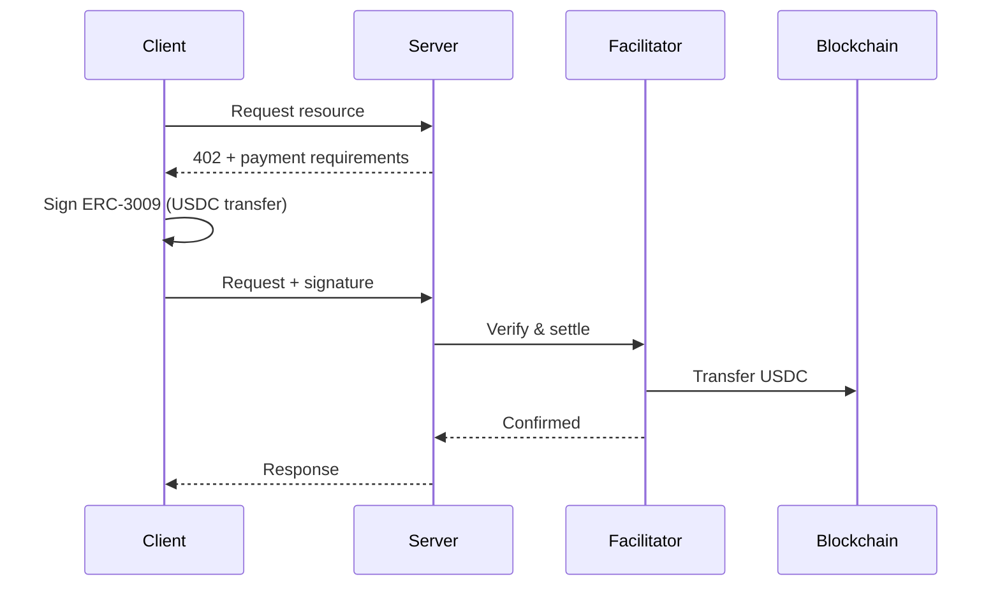
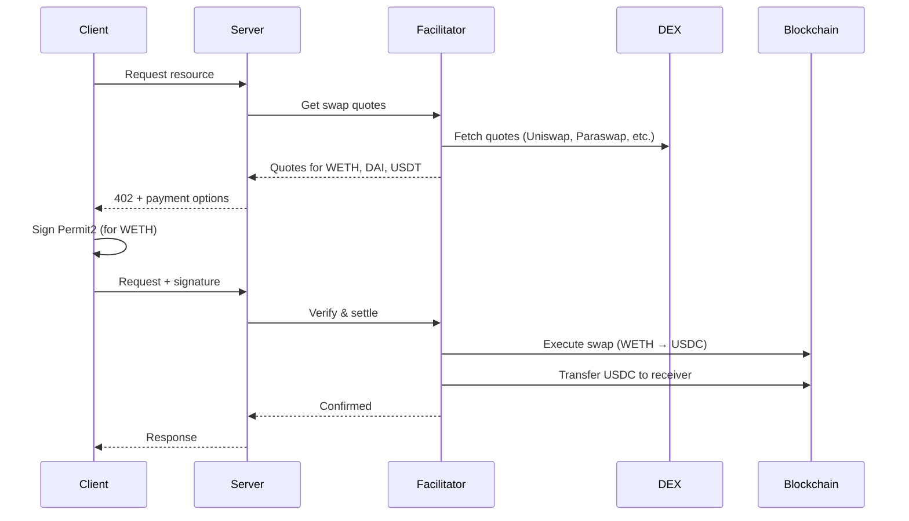

# x402 Facilitator

A production-ready x402 facilitator supporting both **exact** (USDC-only) and **escrow** (multi-token) payment schemes.

<Info>
**What is x402?** The HTTP 402 "Payment Required" status code, finally put to use. x402 is a protocol for API monetization using blockchain payments.
</Info>

## Two Payment Schemes

<CardGroup cols={2}>
  <Card title="exact" icon="receipt" href="/x402/quickstart#exact-scheme-quickstart">
    **USDC-only payments**

    Standard x402. One signature per API call. Simple, USDC only.
  </Card>
  <Card title="escrow" icon="vault" href="/x402/quickstart#escrow-scheme-quickstart">
    **Multi-token payments**

    Pay with WETH, DAI, USDT. Receiver always gets USDC.
  </Card>
</CardGroup>

### Quick Comparison

| | `exact` | `escrow` |
|---|---------|----------|
| **Input tokens** | USDC only | USDC, WETH, DAI, USDT |
| **Output token** | USDC | USDC (swapped automatically) |
| **Signatures** | 1 per request | 1 per request |
| **Gas for user** | None (gasless) | None (gasless) |
| **Best for** | Simple USDC payments | Multi-token flexibility |

<Card title="Detailed Scheme Comparison" icon="code-compare" href="/x402/concepts/schemes">
  Learn when to use each scheme
</Card>

---

## Who Is This For?

<CardGroup cols={2}>
  <Card title="Client Developers" icon="laptop" href="/x402/quickstart#client-exact">
    Building an app that pays for API calls

    - Install SDK
    - Connect wallet
    - Call paid APIs
  </Card>
  <Card title="API Providers" icon="server" href="/x402/quickstart#server-exact">
    Monetizing your API endpoints

    - Get free API key
    - Add middleware
    - Start earning
  </Card>
</CardGroup>

---

## Quick Start

### exact scheme (USDC only)

```bash
npm install @x402/core @x402/fetch @x402/evm viem
```

<CodeGroup>

```typescript Client
import { wrapFetchWithPayment, x402Client } from '@x402/fetch';
import { ExactEvmScheme } from '@x402/evm/exact/client';
import { privateKeyToAccount } from 'viem/accounts';

const account = privateKeyToAccount(process.env.PRIVATE_KEY);

const client = new x402Client()
  .register('eip155:8453', new ExactEvmScheme(account));

const paidFetch = wrapFetchWithPayment(fetch, client);

// 402 responses handled automatically
const response = await paidFetch('https://api.example.com/premium');
```

```typescript Server
import { x402ResourceServer, HTTPFacilitatorClient } from '@x402/core/server';
import { ExactEvmScheme } from '@x402/evm/exact/server';
import { paymentMiddleware } from '@x402/express';

const facilitator = new HTTPFacilitatorClient({
  url: 'https://facilitator.agentokratia.com',
  createAuthHeaders: async () => ({
    verify: { Authorization: `Bearer ${process.env.X402_API_KEY}` },
    settle: { Authorization: `Bearer ${process.env.X402_API_KEY}` },
  }),
});

const server = new x402ResourceServer(facilitator)
  .register('eip155:8453', new ExactEvmScheme());

app.use(paymentMiddleware({
  'GET /api/premium': {
    accepts: { scheme: 'exact', price: '$0.10', network: 'eip155:8453', payTo: '0x...' },
  },
}, server));
```

</CodeGroup>

### escrow scheme (multi-token)

```bash
npm install @x402/core @x402/fetch @x402/evm @agentokratia/x402-escrow viem
```

<CodeGroup>

```typescript Client
import { wrapFetchWithPayment, x402Client } from '@x402/fetch';
import { ExactEvmScheme } from '@x402/evm/exact/client';
import { createWalletClient, createPublicClient, http } from 'viem';
import { privateKeyToAccount } from 'viem/accounts';
import { base } from 'viem/chains';
import {
  EscrowScheme,
  createBalanceSelector,
  preferTokenPolicy,
} from '@agentokratia/x402-escrow/client';

const WETH = '0x4200000000000000000000000000000000000006';
const USDC = '0x833589fCD6eDb6E08f4c7C32D4f71b54bdA02913';

const account = privateKeyToAccount(process.env.PRIVATE_KEY);

const walletClient = createWalletClient({
  account, chain: base, transport: http(),
});

const publicClient = createPublicClient({
  chain: base, transport: http(),
});

// Balance-aware: auto-picks token you can afford
const client = new x402Client(
  createBalanceSelector(publicClient, account.address)
)
  .register('eip155:8453', new ExactEvmScheme(account))
  .register('eip155:8453', new EscrowScheme(walletClient))
  .registerPolicy(preferTokenPolicy([WETH, USDC]));

const paidFetch = wrapFetchWithPayment(fetch, client);

const response = await paidFetch('https://api.example.com/premium');
```

```typescript Server
import { x402ResourceServer, HTTPFacilitatorClient } from '@x402/core/server';
import { ExactEvmScheme } from '@x402/evm/exact/server';
import { EscrowScheme } from '@agentokratia/x402-escrow/server';
import { paymentMiddleware } from '@x402/express';

const facilitator = new HTTPFacilitatorClient({
  url: 'https://facilitator.agentokratia.com',
  createAuthHeaders: async () => ({
    verify: { Authorization: `Bearer ${process.env.X402_API_KEY}` },
    settle: { Authorization: `Bearer ${process.env.X402_API_KEY}` },
  }),
});

const escrow = new EscrowScheme({ facilitator });

const server = new x402ResourceServer(facilitator)
  .register('eip155:8453', new ExactEvmScheme())
  .register('eip155:8453', escrow);

// Auto-discovers supported tokens (USDC, WETH, DAI, USDT)
const escrowAccepts = await escrow.buildAccepts({
  network: 'eip155:8453',
  price: '$0.01',
  payTo: '0xYourWallet...',
});

app.use(paymentMiddleware({
  'GET /api/premium': {
    accepts: [
      { scheme: 'exact', price: '$0.01', network: 'eip155:8453', payTo: '0x...' },
      ...escrowAccepts, // Adds WETH, DAI, USDT options
    ],
  },
}, server));
```

</CodeGroup>

---

## How It Works

### exact scheme flow



### escrow scheme flow (with swap)



---

## Key Features

<CardGroup cols={2}>
  <Card title="Gasless for Users" icon="gas-pump">
    ERC-3009 and Permit2 signatures - no ETH needed
  </Card>
  <Card title="Multi-Token Support" icon="coins">
    Pay with WETH, DAI, USDT - receiver gets USDC
  </Card>
  <Card title="Automatic Swaps" icon="arrows-rotate">
    DEX quotes from Uniswap, Paraswap, OpenOcean
  </Card>
  <Card title="Base Network" icon="layer-group">
    Low fees on Base L2 (mainnet + testnet)
  </Card>
</CardGroup>

---

## Networks

| Network | Status | Use For |
|---------|--------|---------|
| Base Mainnet | ✅ Live | Production |
| Base Sepolia | ✅ Live | Development & testing |

**Facilitator URL:** `https://facilitator.agentokratia.com`

---

## Supported Input Tokens (Base Mainnet)

| Token | Address |
| ----- | ------- |
| USDC  | `0x833589fCD6eDb6E08f4c7C32D4f71b54bdA02913` |
| WETH  | `0x4200000000000000000000000000000000000006` |
| DAI   | `0x50c5725949a6f0c72e6c4a641f24049a917db0cb` |
| USDT  | `0xfde4c96c8593536e31f229ea8f37b2ada2699bb2` |

---

## Next Steps

<CardGroup cols={2}>
  <Card title="Quickstart" icon="rocket" href="/x402/quickstart">
    Step-by-step integration guide
  </Card>
  <Card title="Get API Key" icon="key" href="/x402/getting-api-key">
    Free API key for servers
  </Card>
  <Card title="Payment Schemes" icon="code-compare" href="/x402/concepts/schemes">
    Deep dive into exact vs escrow
  </Card>
  <Card title="API Reference" icon="book" href="/x402/api-reference/overview">
    Full API documentation
  </Card>
</CardGroup>
